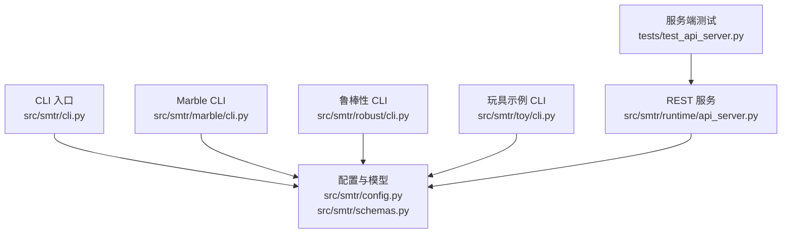
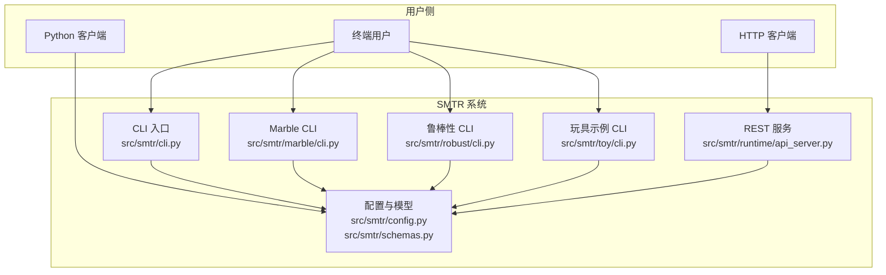
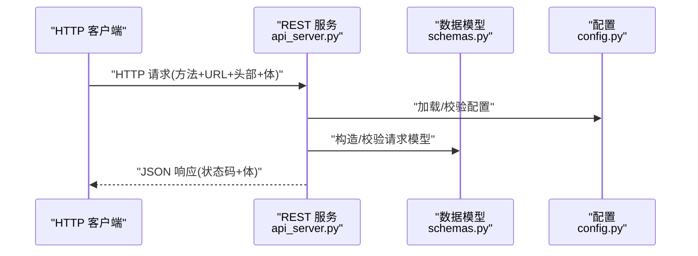
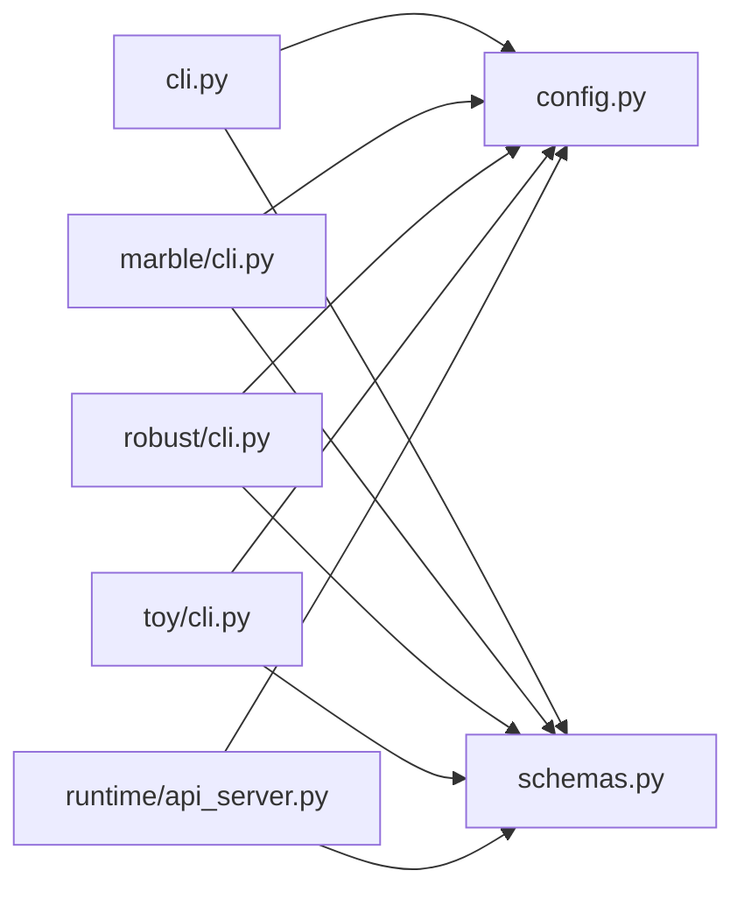

# API参考文档

<cite>
**本文引用的文件**   
- [README.md](file://README.md)
- [pyproject.toml](file://pyproject.toml)
- [src/smtr/cli.py](file://src/smtr/cli.py)
- [src/smtr/config.py](file://src/smtr/config.py)
- [src/smtr/schemas.py](file://src/smtr/schemas.py)
- [src/smtr/runtime/api_server.py](file://src/smtr/runtime/api_server.py)
- [src/smtr/marble/cli.py](file://src/smtr/marble/cli.py)
- [src/smtr/robust/cli.py](file://src/smtr/robust/cli.py)
- [src/smtr/toy/cli.py](file://src/smtr/toy/cli.py)
- [tests/test_api_server.py](file://tests/test_api_server.py)
</cite>

## 目录
1. [简介](#简介)
2. [项目结构](#项目结构)
3. [核心组件](#核心组件)
4. [架构总览](#架构总览)
5. [详细组件分析](#详细组件分析)
6. [依赖关系分析](#依赖关系分析)
7. [性能与限制](#性能与限制)
8. [故障排查指南](#故障排查指南)
9. [结论](#结论)
10. [附录](#附录)

## 简介
本文件为 SMTR 系统的完整 API 参考，覆盖三类接口：
- CLI 命令行接口：提供实验、评估、Marble 集成、鲁棒性分析与玩具示例等子命令。
- Python API：通过模块入口暴露的配置、数据模型与运行时服务（如 API 服务器）供程序化调用。
- REST API 服务：由运行时 HTTP 服务提供的远程调用能力。

文档同时给出请求/响应模式、认证与安全建议、速率限制与性能注意事项、客户端实现指引与调试技巧，并说明版本与向后兼容性策略。

## 项目结构
SMTR 采用模块化组织方式，API 相关代码主要分布在以下位置：
- CLI 入口与子命令：src/smtr/cli.py、src/smtr/marble/cli.py、src/smtr/robust/cli.py、src/smtr/toy/cli.py
- 配置与数据模型：src/smtr/config.py、src/smtr/schemas.py
- REST 服务：src/smtr/runtime/api_server.py
- 测试用例（含服务端行为验证）：tests/test_api_server.py
- 项目元信息与依赖：pyproject.toml、README.md

图表来源
- [src/smtr/cli.py](file://src/smtr/cli.py)
- [src/smtr/config.py](file://src/smtr/config.py)
- [src/smtr/schemas.py](file://src/smtr/schemas.py)
- [src/smtr/marble/cli.py](file://src/smtr/marble/cli.py)
- [src/smtr/robust/cli.py](file://src/smtr/robust/cli.py)
- [src/smtr/toy/cli.py](file://src/smtr/toy/cli.py)
- [src/smtr/runtime/api_server.py](file://src/smtr/runtime/api_server.py)
- [tests/test_api_server.py](file://tests/test_api_server.py)

章节来源
- [README.md](file://README.md)
- [pyproject.toml](file://pyproject.toml)

## 核心组件
本节概述三类接口的职责与边界：
- CLI 命令行接口
  - 顶层入口负责解析主命令与子命令，分发到具体功能模块。
  - 子命令包括 Marble 工具链、鲁棒性分析、玩具示例等。
- Python API
  - 通过配置加载、数据模型定义与服务启动等方式被其他模块或外部脚本调用。
  - 数据模型集中在 schemas 中，用于跨层传递结构化数据。
- REST API 服务
  - 提供基于 HTTP 的远程调用能力，便于非 Python 客户端集成。
  - 包含基础路由、请求校验、错误处理与返回格式约定。

章节来源
- [src/smtr/cli.py](file://src/smtr/cli.py)
- [src/smtr/config.py](file://src/smtr/config.py)
- [src/smtr/schemas.py](file://src/smtr/schemas.py)
- [src/smtr/runtime/api_server.py](file://src/smtr/runtime/api_server.py)

## 架构总览
下图展示从 CLI 到内部模块以及 REST 服务的整体交互关系。

图表来源
- [src/smtr/cli.py](file://src/smtr/cli.py)
- [src/smtr/marble/cli.py](file://src/smtr/marble/cli.py)
- [src/smtr/robust/cli.py](file://src/smtr/robust/cli.py)
- [src/smtr/toy/cli.py](file://src/smtr/toy/cli.py)
- [src/smtr/config.py](file://src/smtr/config.py)
- [src/smtr/schemas.py](file://src/smtr/schemas.py)
- [src/smtr/runtime/api_server.py](file://src/smtr/runtime/api_server.py)

## 详细组件分析

### CLI 命令行接口
- 顶层命令
  - 作用：注册与分发子命令，统一参数解析与帮助输出。
  - 典型用法：在终端执行 smtr 后跟随子命令名称与选项。
- 子命令
  - Marble 工具链：用于数据库环境、数据集、运行与评估等任务。
  - 鲁棒性分析：提供鲁棒性估计、不确定性分析等能力。
  - 玩具示例：轻量级演示与快速验证。
- 通用选项
  - 常见包括日志级别、配置文件路径、输出目录等（以实际实现为准）。
- 使用示例
  - 列出可用子命令与帮助信息。
  - 针对某一子命令查看其参数与示例。

章节来源
- [src/smtr/cli.py](file://src/smtr/cli.py)
- [src/smtr/marble/cli.py](file://src/smtr/marble/cli.py)
- [src/smtr/robust/cli.py](file://src/smtr/robust/cli.py)
- [src/smtr/toy/cli.py](file://src/smtr/toy/cli.py)

### Python API
- 配置加载
  - 提供统一的配置读取与默认值合并机制，支持多来源配置。
- 数据模型
  - 集中定义请求/响应结构、中间结果与持久化格式，确保类型一致性与可序列化。
- 服务启动
  - 可通过编程方式启动 REST 服务，传入端口、主机与可选安全参数。

章节来源
- [src/smtr/config.py](file://src/smtr/config.py)
- [src/smtr/schemas.py](file://src/smtr/schemas.py)
- [src/smtr/runtime/api_server.py](file://src/smtr/runtime/api_server.py)

### REST API 服务
- 服务特性
  - 基于 HTTP 协议，提供 JSON 格式的请求与响应。
  - 内置基础路由、请求体校验与错误响应封装。
- 认证与安全
  - 建议在部署层启用 TLS；如需应用层鉴权，可在服务初始化时注入认证中间件。
- 速率限制
  - 建议结合网关或反向代理进行限流与熔断。
- 典型流程
  - 客户端发送 HTTP 请求至服务地址与端点。
  - 服务端解析请求体、校验参数、执行业务逻辑。
  - 返回标准 JSON 响应，包含状态码与消息体。

图表来源
- [src/smtr/runtime/api_server.py](file://src/smtr/runtime/api_server.py)
- [src/smtr/schemas.py](file://src/smtr/schemas.py)
- [src/smtr/config.py](file://src/smtr/config.py)

章节来源
- [src/smtr/runtime/api_server.py](file://src/smtr/runtime/api_server.py)
- [tests/test_api_server.py](file://tests/test_api_server.py)

## 依赖关系分析
- 模块耦合
  - CLI 与子命令均依赖配置与数据模型，保持低耦合与高内聚。
  - REST 服务同样依赖配置与模型，保证请求/响应一致性。
- 外部依赖
  - 通过 pyproject.toml 声明运行时依赖，便于安装与环境管理。
- 潜在循环依赖
  - 当前结构将公共模型与配置置于独立模块，避免循环导入风险。

图表来源
- [src/smtr/cli.py](file://src/smtr/cli.py)
- [src/smtr/marble/cli.py](file://src/smtr/marble/cli.py)
- [src/smtr/robust/cli.py](file://src/smtr/robust/cli.py)
- [src/smtr/toy/cli.py](file://src/smtr/toy/cli.py)
- [src/smtr/config.py](file://src/smtr/config.py)
- [src/smtr/schemas.py](file://src/smtr/schemas.py)
- [src/smtr/runtime/api_server.py](file://src/smtr/runtime/api_server.py)

章节来源
- [pyproject.toml](file://pyproject.toml)

## 性能与限制
- 并发与吞吐
  - 建议在生产环境使用多进程或多线程的 WSGI/ASGI 服务器承载 REST 服务。
- I/O 与序列化
  - 大体积请求/响应需考虑分块传输与压缩；合理设计数据模型以减少冗余字段。
- 资源上限
  - 对 CPU/内存敏感的操作应设置超时与配额，防止单请求占用过多资源。
- 缓存与幂等
  - 对读多写少的接口引入缓存；对写操作确保幂等设计，便于重试与恢复。

[本节为通用指导，不直接分析具体文件]

## 故障排查指南
- 常见问题定位
  - 检查服务是否成功启动与监听端口。
  - 核对请求头、方法与 URL 是否符合预期。
  - 确认请求体结构与数据模型定义一致。
- 日志与诊断
  - 开启更详细的日志级别，记录关键步骤与异常堆栈。
  - 使用测试用例作为最小复现场景，逐步缩小问题范围。
- 网络与安全
  - 验证 TLS 证书与域名解析。
  - 若启用鉴权，检查令牌签发与校验逻辑。

章节来源
- [tests/test_api_server.py](file://tests/test_api_server.py)

## 结论
SMTR 系统通过清晰的模块化设计，将 CLI、Python API 与 REST 服务解耦，并以统一的配置与数据模型贯穿各层。生产部署建议结合反向代理、TLS、鉴权与限流等机制，保障安全性与稳定性。

[本节为总结性内容，不直接分析具体文件]

## 附录

### 版本与向后兼容
- 版本标识
  - 版本号与变更日志请参考项目元信息与发布说明。
- 兼容性策略
  - 新增字段应保持向后兼容；废弃字段保留过渡期提示。
  - 破坏性变更应在新版本中明确标注并提供迁移指南。

章节来源
- [README.md](file://README.md)
- [pyproject.toml](file://pyproject.toml)

### 客户端实现指南
- 通用要点
  - 遵循统一的请求/响应数据模型，严格校验必填字段。
  - 实现重试与退避策略，处理临时性错误。
  - 记录请求 ID 与时间戳，便于追踪与审计。
- 认证与授权
  - 优先使用 HTTPS；必要时在请求头携带鉴权令牌。
- 调试技巧
  - 使用抓包工具或日志打印原始请求/响应。
  - 借助最小化测试用例快速验证连通性与权限。

[本节为通用指导，不直接分析具体文件]