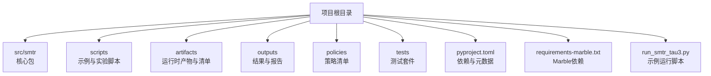
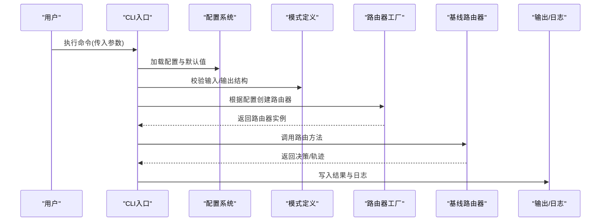
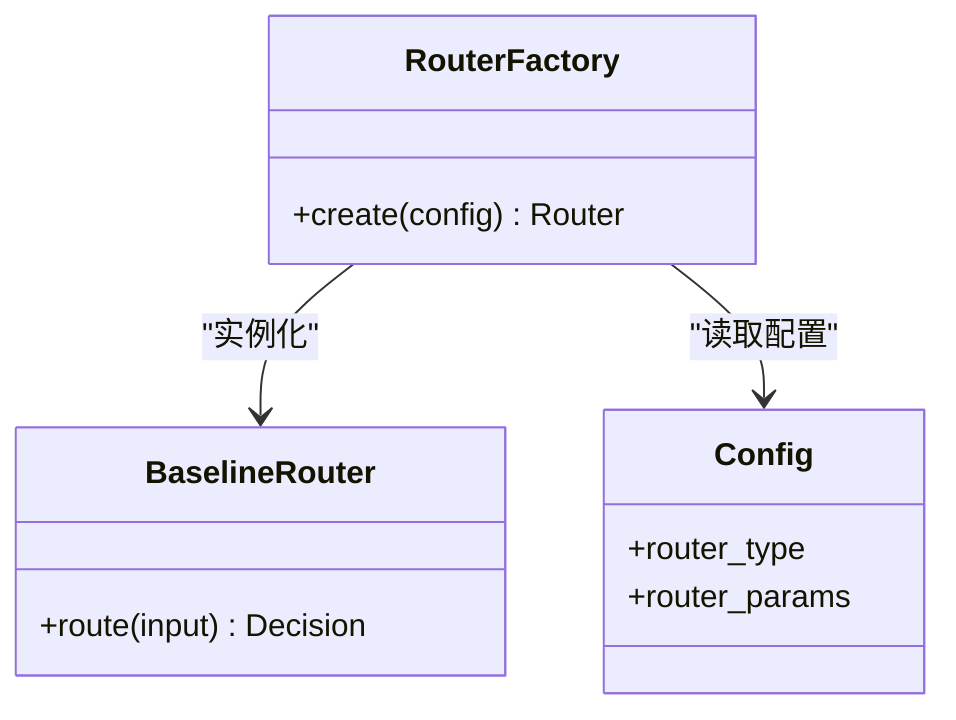
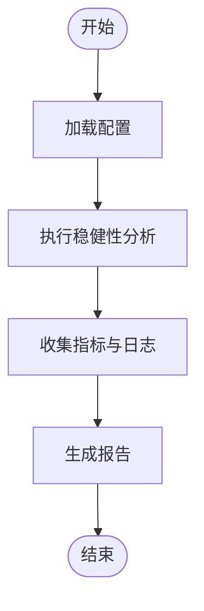
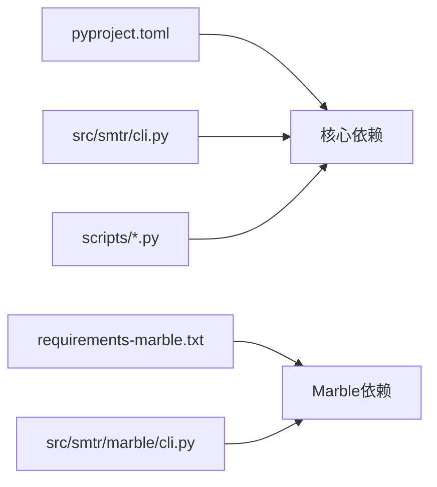

# 快速开始

<cite>
**本文引用的文件**   
- [README.md](file://README.md)
- [pyproject.toml](file://pyproject.toml)
- [requirements-marble.txt](file://requirements-marble.txt)
- [src/smtr/cli.py](file://src/smtr/cli.py)
- [src/smtr/config.py](file://src/smtr/config.py)
- [src/smtr/schemas.py](file://src/smtr/schemas.py)
- [src/smtr/router/factory.py](file://src/smtr/router/factory.py)
- [src/smtr/router/baseline_router.py](file://src/smtr/router/baseline_router.py)
- [src/smtr/robust/cli.py](file://src/smtr/robust/cli.py)
- [src/smtr/marble/cli.py](file://src/smtr/marble/cli.py)
- [scripts/run_ablation_experiments.py](file://scripts/run_ablation_experiments.py)
- [scripts/task6_smoke_test.py](file://scripts/task6_smoke_test.py)
- [run_smtr_tau3.py](file://run_smtr_tau3.py)
</cite>

## 目录
1. [简介](#简介)
2. [项目结构](#项目结构)
3. [核心组件](#核心组件)
4. [架构总览](#架构总览)
5. [详细组件分析](#详细组件分析)
6. [依赖关系分析](#依赖关系分析)
7. [性能与资源建议](#性能与资源建议)
8. [故障排除指南](#故障排除指南)
9. [结论](#结论)
10. [附录](#附录)

## 简介
本快速开始指南面向初次接触 SMTR 的用户，目标是帮助你在最短时间内完成环境准备、安装依赖、配置并运行第一个路由任务。SMTR 提供可插拔的路由器与评估框架，支持基线路由器、稳健性增强、Marble 集成等能力。通过 CLI 和脚本入口，你可以快速体验从数据到结果输出的完整流程。

## 项目结构
仓库采用模块化组织方式：
- src/smtr：核心代码，包含 CLI、配置、模式定义、路由器、稳健性模块、Marble 集成等
- scripts：实验与示例脚本（如消融实验、冒烟测试）
- artifacts：运行时产物、工作区、清单与输出样例
- outputs：实验与评估结果汇总
- policies：策略清单
- tests：单元测试与集成测试
- pyproject.toml：项目元数据与依赖声明
- requirements-marble.txt：Marble 相关依赖
- run_smtr_tau3.py：示例运行脚本

[本节为概览说明，不直接分析具体文件]

## 核心组件
- CLI 入口：提供命令行接口，用于执行任务、查看帮助与参数
- 配置系统：集中管理配置项与默认值
- 模式定义：统一的数据结构与校验
- 路由器工厂：按名称或配置动态创建路由器实例
- 基线路由器：提供简单可用的默认路由逻辑
- 稳健性模块：CLI 与工具，用于稳健性分析与估计
- Marble 集成：数据库与环境相关的 CLI 与工具
- 示例脚本：快速验证与演示的脚本入口

章节来源
- [src/smtr/cli.py](file://src/smtr/cli.py)
- [src/smtr/config.py](file://src/smtr/config.py)
- [src/smtr/schemas.py](file://src/smtr/schemas.py)
- [src/smtr/router/factory.py](file://src/smtr/router/factory.py)
- [src/smtr/router/baseline_router.py](file://src/smtr/router/baseline_router.py)
- [src/smtr/robust/cli.py](file://src/smtr/robust/cli.py)
- [src/smtr/marble/cli.py](file://src/smtr/marble/cli.py)
- [scripts/run_ablation_experiments.py](file://scripts/run_ablation_experiments.py)
- [scripts/task6_smoke_test.py](file://scripts/task6_smoke_test.py)
- [run_smtr_tau3.py](file://run_smtr_tau3.py)

## 架构总览
下图展示了从用户调用到路由器执行与结果产出的基本流程。

图表来源
- [src/smtr/cli.py](file://src/smtr/cli.py)
- [src/smtr/config.py](file://src/smtr/config.py)
- [src/smtr/schemas.py](file://src/smtr/schemas.py)
- [src/smtr/router/factory.py](file://src/smtr/router/factory.py)
- [src/smtr/router/baseline_router.py](file://src/smtr/router/baseline_router.py)

章节来源
- [src/smtr/cli.py](file://src/smtr/cli.py)
- [src/smtr/config.py](file://src/smtr/config.py)
- [src/smtr/schemas.py](file://src/smtr/schemas.py)
- [src/smtr/router/factory.py](file://src/smtr/router/factory.py)
- [src/smtr/router/baseline_router.py](file://src/smtr/router/baseline_router.py)

## 详细组件分析

### 安装与环境准备
- Python 版本要求
  - 参考项目元数据与依赖声明，确认当前环境满足最低 Python 版本要求
- 依赖安装
  - 使用项目依赖声明进行安装（推荐虚拟环境）
  - 若需使用 Marble 功能，额外安装 Marble 相关依赖
- 可选：构建与开发依赖
  - 如需运行测试或参与开发，请安装测试与开发依赖

章节来源
- [pyproject.toml](file://pyproject.toml)
- [requirements-marble.txt](file://requirements-marble.txt)

### 基础使用：运行第一个路由任务
- 步骤一：检查 CLI 帮助
  - 在终端中查看可用命令与参数说明
- 步骤二：准备最小化配置
  - 使用默认配置或提供必要字段的最小配置
- 步骤三：执行路由任务
  - 通过 CLI 或示例脚本启动一次路由运行
- 步骤四：查看输出
  - 检查生成的结果文件与日志，确认任务成功

章节来源
- [src/smtr/cli.py](file://src/smtr/cli.py)
- [src/smtr/config.py](file://src/smtr/config.py)
- [run_smtr_tau3.py](file://run_smtr_tau3.py)

### 常用配置选项与使用模式
- 配置来源
  - 环境变量、配置文件、命令行覆盖
- 关键配置项
  - 路由器类型与参数
  - 输入/输出路径
  - 日志级别与调试开关
- 使用模式
  - 单任务运行
  - 批量任务（结合脚本）
  - 与 Marble 集成（数据库/环境）

章节来源
- [src/smtr/config.py](file://src/smtr/config.py)
- [src/smtr/schemas.py](file://src/smtr/schemas.py)
- [src/smtr/marble/cli.py](file://src/smtr/marble/cli.py)

### 路由器与工厂
- 路由器工厂
  - 根据配置选择并实例化路由器
- 基线路由器
  - 提供简单、稳定的默认路由逻辑，适合快速上手
- 扩展点
  - 自定义路由器实现并通过工厂注册

图表来源
- [src/smtr/router/factory.py](file://src/smtr/router/factory.py)
- [src/smtr/router/baseline_router.py](file://src/smtr/router/baseline_router.py)
- [src/smtr/config.py](file://src/smtr/config.py)

章节来源
- [src/smtr/router/factory.py](file://src/smtr/router/factory.py)
- [src/smtr/router/baseline_router.py](file://src/smtr/router/baseline_router.py)

### 稳健性与评估
- 稳健性 CLI
  - 提供稳健性分析、估计与诊断工具
- 评估与实验脚本
  - 提供消融实验与冒烟测试脚本，便于快速验证

图表来源
- [src/smtr/robust/cli.py](file://src/smtr/robust/cli.py)
- [scripts/run_ablation_experiments.py](file://scripts/run_ablation_experiments.py)
- [scripts/task6_smoke_test.py](file://scripts/task6_smoke_test.py)

章节来源
- [src/smtr/robust/cli.py](file://src/smtr/robust/cli.py)
- [scripts/run_ablation_experiments.py](file://scripts/run_ablation_experiments.py)
- [scripts/task6_smoke_test.py](file://scripts/task6_smoke_test.py)

### Marble 集成
- Marble CLI
  - 提供数据库与环境相关的子命令
- 典型用法
  - 初始化环境、运行冒烟测试、查看能力清单

章节来源
- [src/smtr/marble/cli.py](file://src/smtr/marble/cli.py)
- [requirements-marble.txt](file://requirements-marble.txt)

## 依赖关系分析
- 项目依赖
  - 通过 pyproject.toml 声明核心依赖
- Marble 依赖
  - 通过 requirements-marble.txt 单独维护
- 运行时依赖
  - 示例脚本与 CLI 依赖上述模块

图表来源
- [pyproject.toml](file://pyproject.toml)
- [requirements-marble.txt](file://requirements-marble.txt)
- [src/smtr/cli.py](file://src/smtr/cli.py)
- [src/smtr/marble/cli.py](file://src/smtr/marble/cli.py)
- [scripts/run_ablation_experiments.py](file://scripts/run_ablation_experiments.py)

章节来源
- [pyproject.toml](file://pyproject.toml)
- [requirements-marble.txt](file://requirements-marble.txt)
- [src/smtr/cli.py](file://src/smtr/cli.py)
- [src/smtr/marble/cli.py](file://src/smtr/marble/cli.py)
- [scripts/run_ablation_experiments.py](file://scripts/run_ablation_experiments.py)

## 性能与资源建议
- 并行与批处理
  - 合理设置并发度，避免资源争用
- 内存与磁盘
  - 大任务时预留足够内存与临时空间
- 日志与输出
  - 控制日志级别，减少不必要的 I/O

[本节为通用建议，不直接分析具体文件]

## 故障排除指南
- 常见问题
  - Python 版本不匹配：检查并升级至兼容版本
  - 依赖缺失：重新安装核心与 Marble 依赖
  - 权限问题：确保对输出目录有写权限
  - 网络与外部服务：检查 API 密钥与网络连通性
- 定位问题
  - 启用更详细的日志
  - 使用冒烟测试脚本验证环境
  - 查看错误日志与输出文件

章节来源
- [scripts/task6_smoke_test.py](file://scripts/task6_smoke_test.py)
- [src/smtr/cli.py](file://src/smtr/cli.py)

## 结论
通过以上步骤，你已完成 SMTR 的安装、配置与首次运行。建议从基线路由器开始，逐步探索稳健性模块与 Marble 集成。遇到问题时，优先使用冒烟测试与日志定位，再结合配置与模式定义进行排查。

[本节为总结性内容，不直接分析具体文件]

## 附录
- 参考文档
  - README：项目背景与总体说明
- 示例脚本
  - run_smtr_tau3.py：示例运行入口
  - scripts/run_ablation_experiments.py：消融实验脚本
  - scripts/task6_smoke_test.py：冒烟测试脚本

章节来源
- [README.md](file://README.md)
- [run_smtr_tau3.py](file://run_smtr_tau3.py)
- [scripts/run_ablation_experiments.py](file://scripts/run_ablation_experiments.py)
- [scripts/task6_smoke_test.py](file://scripts/task6_smoke_test.py)