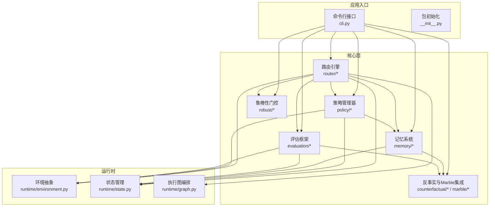
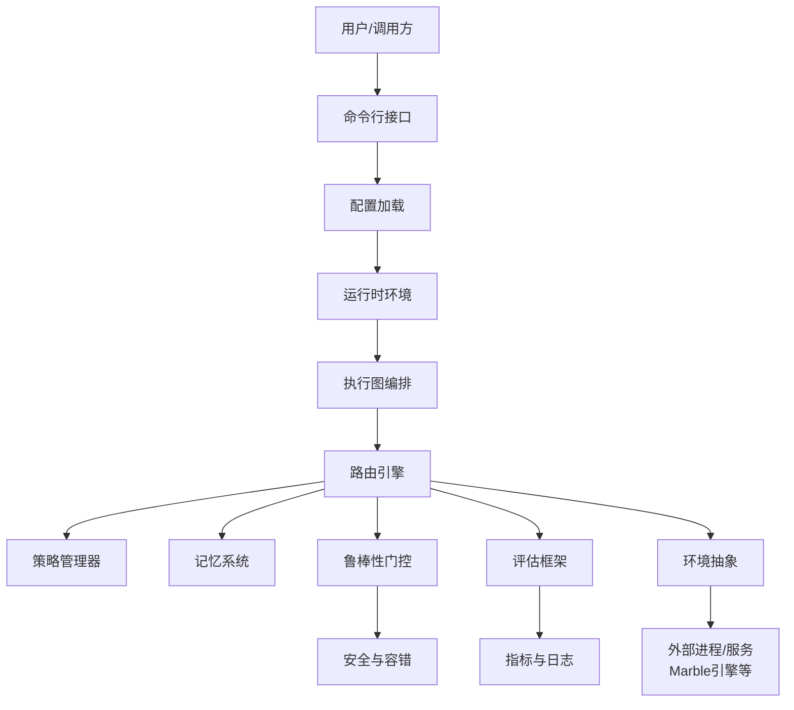
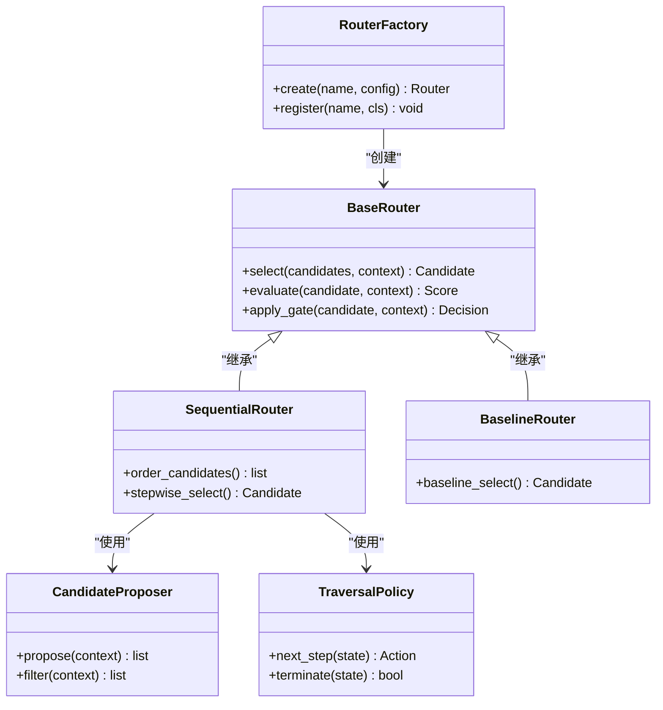
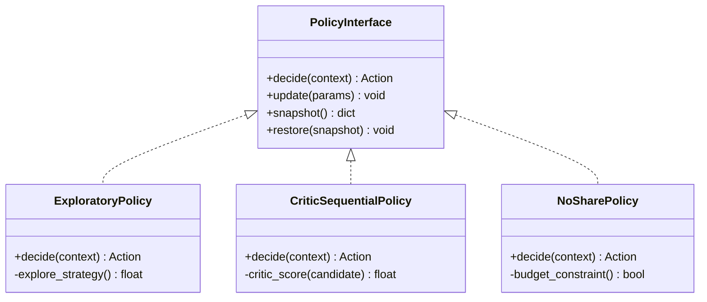
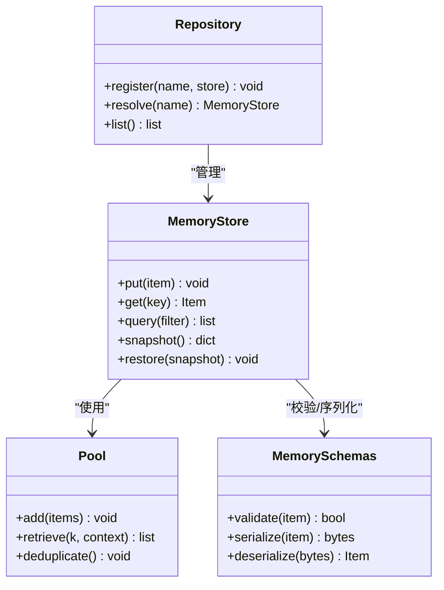
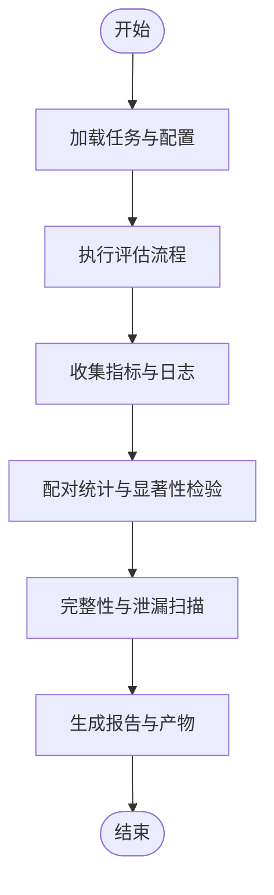
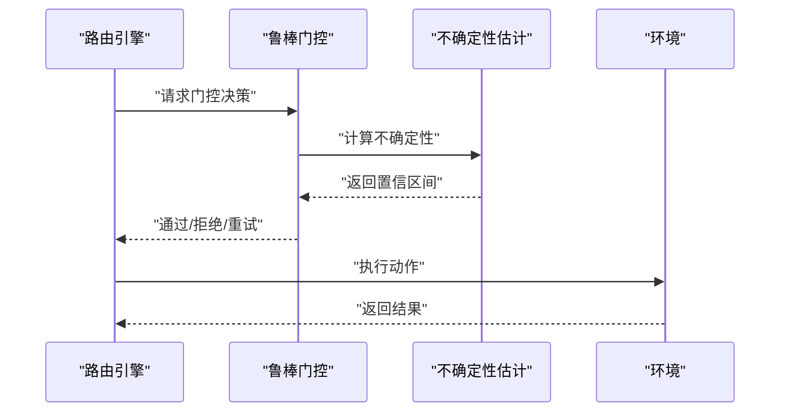
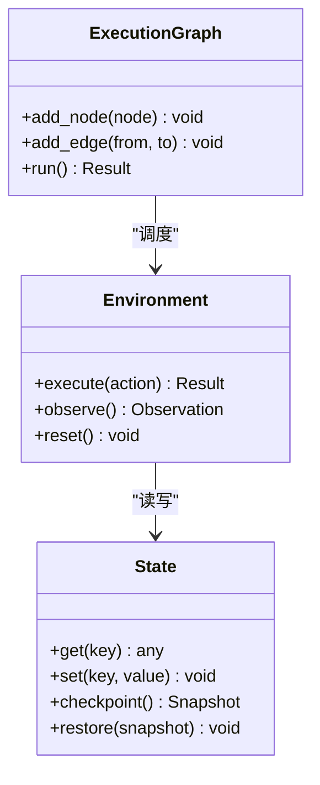
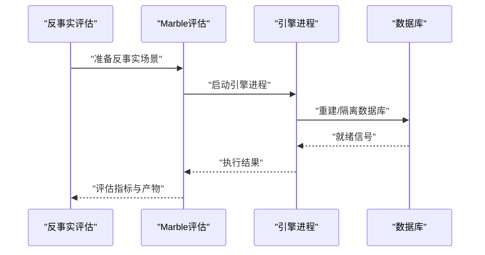
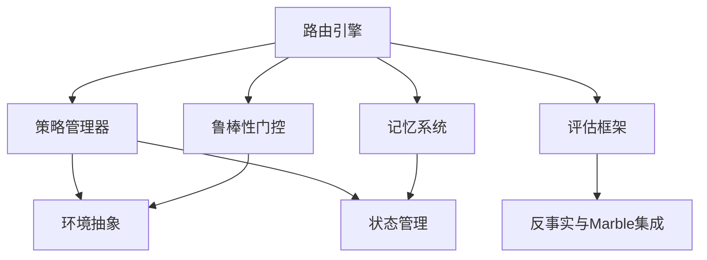

# 架构设计

<cite>
**本文引用的文件**   
- [README.md](file://README.md)
- [pyproject.toml](file://pyproject.toml)
- [src/smtr/__init__.py](file://src/smtr/__init__.py)
- [src/smtr/cli.py](file://src/smtr/cli.py)
- [src/smtr/config.py](file://src/smtr/config.py)
- [src/smtr/schemas.py](file://src/smtr/schemas.py)
- [src/smtr/router/factory.py](file://src/smtr/router/factory.py)
- [src/smtr/router/interfaces.py](file://src/smtr/router/interfaces.py)
- [src/smtr/router/sequential_router.py](file://src/smtr/router/sequential_router.py)
- [src/smtr/router/baseline_router.py](file://src/smtr/router/baseline_router.py)
- [src/smtr/router/candidate_proposer.py](file://src/smtr/router/candidate_proposer.py)
- [src/smtr/router/traversal.py](file://src/smtr/router/traversal.py)
- [src/smtr/policy/exploratory_policy.py](file://src/smtr/policy/exploratory_policy.py)
- [src/smtr/policy/critic_sequential_policy.py](file://src/smtr/policy/critic_sequential_policy.py)
- [src/smtr/policy/no_share_policy.py](file://src/smtr/policy/no_share_policy.py)
- [src/smtr/memory/store.py](file://src/smtr/memory/store.py)
- [src/smtr/memory/repository.py](file://src/smtr/memory/repository.py)
- [src/smtr/memory/pool.py](file://src/smtr/memory/pool.py)
- [src/smtr/memory/schemas.py](file://src/smtr/memory/schemas.py)
- [src/smtr/runtime/environment.py](file://src/smtr/runtime/environment.py)
- [src/smtr/runtime/state.py](file://src/smtr/runtime/state.py)
- [src/smtr/runtime/graph.py](file://src/smtr/runtime/graph.py)
- [src/smtr/evaluation/task_evaluation.py](file://src/smtr/evaluation/task_evaluation.py)
- [src/smtr/robust/robust_gate.py](file://src/smtr/robust/robust_gate.py)
- [src/smtr/counterfactual/marble_eval.py](file://src/smtr/counterfactual/marble_eval.py)
- [src/smtr/marble/engine_process.py](file://src/smtr/marble/engine_process.py)
</cite>

## 目录
1. [简介](#简介)
2. [项目结构](#项目结构)
3. [核心组件](#核心组件)
4. [架构总览](#架构总览)
5. [详细组件分析](#详细组件分析)
6. [依赖分析](#依赖分析)
7. [性能考虑](#性能考虑)
8. [故障排查指南](#故障排查指南)
9. [结论](#结论)
10. [附录](#附录)

## 简介
本架构设计文档面向SMTR系统，聚焦高层设计原则、架构模式与系统边界，阐述路由引擎、策略管理器、记忆系统与评估框架的协作机制，解释数据流与状态管理，并给出技术决策、权衡与约束。文档同时覆盖扩展点与插件机制、跨领域关注点（安全性、监控、错误处理）、技术栈与依赖、部署拓扑与基础设施需求。

## 项目结构
SMTR采用分层与按功能域组织相结合的结构：
- src/smtr：核心代码，包含路由、策略、记忆、运行时、评估、鲁棒性、反事实与Marble集成等模块
- artifacts：实验产物、清单与运行记录
- checkpoints：模型或策略检查点元数据
- data：数据集、轨迹与中间结果
- docs：设计与研究文档
- outputs：实验输出与报告
- policies：策略配置清单
- scripts：实验脚本与工具
- tests：单元测试与集成测试

图表来源
- [src/smtr/cli.py:1-200](file://src/smtr/cli.py#L1-L200)
- [src/smtr/router/factory.py:1-200](file://src/smtr/router/factory.py#L1-L200)
- [src/smtr/policy/exploratory_policy.py:1-200](file://src/smtr/policy/exploratory_policy.py#L1-L200)
- [src/smtr/memory/store.py:1-200](file://src/smtr/memory/store.py#L1-L200)
- [src/smtr/evaluation/task_evaluation.py:1-200](file://src/smtr/evaluation/task_evaluation.py#L1-L200)
- [src/smtr/runtime/environment.py:1-200](file://src/smtr/runtime/environment.py#L1-L200)
- [src/smtr/runtime/state.py:1-200](file://src/smtr/runtime/state.py#L1-L200)
- [src/smtr/runtime/graph.py:1-200](file://src/smtr/runtime/graph.py#L1-L200)

章节来源
- [README.md:1-200](file://README.md#L1-L200)
- [pyproject.toml:1-200](file://pyproject.toml#L1-L200)
- [src/smtr/__init__.py:1-200](file://src/smtr/__init__.py#L1-L200)
- [src/smtr/cli.py:1-200](file://src/smtr/cli.py#L1-L200)

## 核心组件
- 路由引擎：负责候选生成、顺序选择、条件分支与门控决策，协调策略与记忆访问，驱动评估与鲁棒性校验。
- 策略管理器：提供探索式、批评者顺序式、无共享等多种策略实现，定义策略接口与注册机制。
- 记忆系统：维护程序片段、执行证据、元过程与池化检索，支持快照与持久化。
- 评估框架：任务级评估、配对统计、泄漏扫描、时序完整性与静态集诊断等。
- 鲁棒性与不确定性：鲁棒门控、不确定性估计与校正，提升决策稳定性。
- 运行时与环境：环境抽象、状态机、执行图编排，支撑多Agent与外部进程交互。
- 反事实与Marble集成：反事实采样、成对展开、数据库重建与隔离、能力清单与预检。

章节来源
- [src/smtr/router/factory.py:1-200](file://src/smtr/router/factory.py#L1-L200)
- [src/smtr/router/interfaces.py:1-200](file://src/smtr/router/interfaces.py#L1-L200)
- [src/smtr/policy/exploratory_policy.py:1-200](file://src/smtr/policy/exploratory_policy.py#L1-L200)
- [src/smtr/memory/store.py:1-200](file://src/smtr/memory/store.py#L1-L200)
- [src/smtr/evaluation/task_evaluation.py:1-200](file://src/smtr/evaluation/task_evaluation.py#L1-L200)
- [src/smtr/robust/robust_gate.py:1-200](file://src/smtr/robust/robust_gate.py#L1-L200)
- [src/smtr/runtime/environment.py:1-200](file://src/smtr/runtime/environment.py#L1-L200)
- [src/smtr/runtime/state.py:1-200](file://src/smtr/runtime/state.py#L1-L200)
- [src/smtr/runtime/graph.py:1-200](file://src/smtr/runtime/graph.py#L1-L200)
- [src/smtr/counterfactual/marble_eval.py:1-200](file://src/smtr/counterfactual/marble_eval.py#L1-L200)
- [src/smtr/marble/engine_process.py:1-200](file://src/smtr/marble/engine_process.py#L1-L200)

## 架构总览
SMTR采用“路由为中心”的分层架构：
- 控制面：CLI与配置加载，构建运行时环境与执行图
- 决策面：路由引擎根据策略与记忆进行候选选择与门控
- 执行面：环境抽象与外部进程（如Marble引擎）交互
- 观测面：评估框架与鲁棒性门控提供度量与稳定性保障

图表来源
- [src/smtr/cli.py:1-200](file://src/smtr/cli.py#L1-L200)
- [src/smtr/config.py:1-200](file://src/smtr/config.py#L1-L200)
- [src/smtr/runtime/graph.py:1-200](file://src/smtr/runtime/graph.py#L1-L200)
- [src/smtr/router/factory.py:1-200](file://src/smtr/router/factory.py#L1-L200)
- [src/smtr/policy/exploratory_policy.py:1-200](file://src/smtr/policy/exploratory_policy.py#L1-L200)
- [src/smtr/memory/store.py:1-200](file://src/smtr/memory/store.py#L1-L200)
- [src/smtr/robust/robust_gate.py:1-200](file://src/smtr/robust/robust_gate.py#L1-L200)
- [src/smtr/evaluation/task_evaluation.py:1-200](file://src/smtr/evaluation/task_evaluation.py#L1-L200)
- [src/smtr/runtime/environment.py:1-200](file://src/smtr/runtime/environment.py#L1-L200)
- [src/smtr/marble/engine_process.py:1-200](file://src/smtr/marble/engine_process.py#L1-L200)

## 详细组件分析

### 路由引擎
职责与模式：
- 工厂模式：通过工厂创建具体路由器实例，支持基线、顺序与自定义路由
- 策略组合：路由可组合多个策略与门控，形成复杂决策流程
- 条件与遍历：基于条件与遍历策略推进候选空间搜索

关键类与方法关系：

图表来源
- [src/smtr/router/factory.py:1-200](file://src/smtr/router/factory.py#L1-L200)
- [src/smtr/router/interfaces.py:1-200](file://src/smtr/router/interfaces.py#L1-L200)
- [src/smtr/router/sequential_router.py:1-200](file://src/smtr/router/sequential_router.py#L1-L200)
- [src/smtr/router/baseline_router.py:1-200](file://src/smtr/router/baseline_router.py#L1-L200)
- [src/smtr/router/candidate_proposer.py:1-200](file://src/smtr/router/candidate_proposer.py#L1-L200)
- [src/smtr/router/traversal.py:1-200](file://src/smtr/router/traversal.py#L1-L200)

章节来源
- [src/smtr/router/factory.py:1-200](file://src/smtr/router/factory.py#L1-L200)
- [src/smtr/router/interfaces.py:1-200](file://src/smtr/router/interfaces.py#L1-L200)
- [src/smtr/router/sequential_router.py:1-200](file://src/smtr/router/sequential_router.py#L1-L200)
- [src/smtr/router/baseline_router.py:1-200](file://src/smtr/router/baseline_router.py#L1-L200)
- [src/smtr/router/candidate_proposer.py:1-200](file://src/smtr/router/candidate_proposer.py#L1-L200)
- [src/smtr/router/traversal.py:1-200](file://src/smtr/router/traversal.py#L1-L200)

### 策略管理器
职责与模式：
- 策略接口统一：所有策略实现统一的调用签名与上下文契约
- 在线刷新：支持策略参数与权重动态更新
- 指纹与清单：策略版本与能力清单管理

图表来源
- [src/smtr/policy/exploratory_policy.py:1-200](file://src/smtr/policy/exploratory_policy.py#L1-L200)
- [src/smtr/policy/critic_sequential_policy.py:1-200](file://src/smtr/policy/critic_sequential_policy.py#L1-L200)
- [src/smtr/policy/no_share_policy.py:1-200](file://src/smtr/policy/no_share_policy.py#L1-L200)

章节来源
- [src/smtr/policy/exploratory_policy.py:1-200](file://src/smtr/policy/exploratory_policy.py#L1-L200)
- [src/smtr/policy/critic_sequential_policy.py:1-200](file://src/smtr/policy/critic_sequential_policy.py#L1-L200)
- [src/smtr/policy/no_share_policy.py:1-200](file://src/smtr/policy/no_share_policy.py#L1-L200)

### 记忆系统
职责与模式：
- 存储与检索：程序片段、执行证据、元过程与池化检索
- 快照与持久化：支持状态快照与序列化
- 仓库与池：仓库负责集合管理，池负责高效检索与去重

图表来源
- [src/smtr/memory/store.py:1-200](file://src/smtr/memory/store.py#L1-L200)
- [src/smtr/memory/repository.py:1-200](file://src/smtr/memory/repository.py#L1-L200)
- [src/smtr/memory/pool.py:1-200](file://src/smtr/memory/pool.py#L1-L200)
- [src/smtr/memory/schemas.py:1-200](file://src/smtr/memory/schemas.py#L1-L200)

章节来源
- [src/smtr/memory/store.py:1-200](file://src/smtr/memory/store.py#L1-L200)
- [src/smtr/memory/repository.py:1-200](file://src/smtr/memory/repository.py#L1-L200)
- [src/smtr/memory/pool.py:1-200](file://src/smtr/memory/pool.py#L1-L200)
- [src/smtr/memory/schemas.py:1-200](file://src/smtr/memory/schemas.py#L1-L200)

### 评估框架
职责与模式：
- 任务评估：标准化任务输入输出与评分函数
- 配对统计与审计：对比不同策略或配置的效果
- 泄漏扫描与时序完整性：确保评估公正与因果一致

图表来源
- [src/smtr/evaluation/task_evaluation.py:1-200](file://src/smtr/evaluation/task_evaluation.py#L1-L200)

章节来源
- [src/smtr/evaluation/task_evaluation.py:1-200](file://src/smtr/evaluation/task_evaluation.py#L1-L200)

### 鲁棒性与不确定性
职责与模式：
- 鲁棒门控：在关键决策点进行稳健性校验与回退
- 不确定性估计：量化模型或环境的噪声影响

图表来源
- [src/smtr/robust/robust_gate.py:1-200](file://src/smtr/robust/robust_gate.py#L1-L200)

章节来源
- [src/smtr/robust/robust_gate.py:1-200](file://src/smtr/robust/robust_gate.py#L1-L200)

### 运行时与环境
职责与模式：
- 环境抽象：屏蔽外部进程与服务差异
- 状态管理：集中维护会话、轨迹与资源
- 执行图：以有向图编排步骤与依赖

图表来源
- [src/smtr/runtime/environment.py:1-200](file://src/smtr/runtime/environment.py#L1-L200)
- [src/smtr/runtime/state.py:1-200](file://src/smtr/runtime/state.py#L1-L200)
- [src/smtr/runtime/graph.py:1-200](file://src/smtr/runtime/graph.py#L1-L200)

章节来源
- [src/smtr/runtime/environment.py:1-200](file://src/smtr/runtime/environment.py#L1-L200)
- [src/smtr/runtime/state.py:1-200](file://src/smtr/runtime/state.py#L1-L200)
- [src/smtr/runtime/graph.py:1-200](file://src/smtr/runtime/graph.py#L1-L200)

### 反事实与Marble集成
职责与模式：
- 反事实评估：构造对比场景与成对展开
- Marble集成：数据库重建、隔离、能力清单与预检

图表来源
- [src/smtr/counterfactual/marble_eval.py:1-200](file://src/smtr/counterfactual/marble_eval.py#L1-L200)
- [src/smtr/marble/engine_process.py:1-200](file://src/smtr/marble/engine_process.py#L1-L200)

章节来源
- [src/smtr/counterfactual/marble_eval.py:1-200](file://src/smtr/counterfactual/marble_eval.py#L1-L200)
- [src/smtr/marble/engine_process.py:1-200](file://src/smtr/marble/engine_process.py#L1-L200)

## 依赖分析
- 内部依赖：路由依赖策略与记忆；策略依赖环境与状态；评估依赖环境与反事实；鲁棒性门控贯穿决策路径
- 外部依赖：Marble引擎进程、数据库、LLM服务（可选）
- 耦合与内聚：通过接口与工厂降低耦合，保持模块内聚

图表来源
- [src/smtr/router/factory.py:1-200](file://src/smtr/router/factory.py#L1-L200)
- [src/smtr/policy/exploratory_policy.py:1-200](file://src/smtr/policy/exploratory_policy.py#L1-L200)
- [src/smtr/memory/store.py:1-200](file://src/smtr/memory/store.py#L1-L200)
- [src/smtr/evaluation/task_evaluation.py:1-200](file://src/smtr/evaluation/task_evaluation.py#L1-L200)
- [src/smtr/robust/robust_gate.py:1-200](file://src/smtr/robust/robust_gate.py#L1-L200)
- [src/smtr/runtime/environment.py:1-200](file://src/smtr/runtime/environment.py#L1-L200)
- [src/smtr/runtime/state.py:1-200](file://src/smtr/runtime/state.py#L1-L200)
- [src/smtr/counterfactual/marble_eval.py:1-200](file://src/smtr/counterfactual/marble_eval.py#L1-L200)

章节来源
- [pyproject.toml:1-200](file://pyproject.toml#L1-L200)
- [src/smtr/__init__.py:1-200](file://src/smtr/__init__.py#L1-L200)

## 性能考虑
- 记忆检索优化：池化与去重减少重复计算，索引与过滤提升查询效率
- 并行与批处理：评估与反事实场景可并行执行，注意资源隔离与锁
- 缓存与快照：策略与环境状态快照避免重复初始化
- 资源限制：预算约束与门控回退防止过度消耗

[本节为通用指导，不直接分析具体文件]

## 故障排查指南
- 常见问题定位：
  - 路由选择异常：检查策略配置与候选生成逻辑
  - 记忆缺失或污染：验证仓库注册与快照恢复
  - 评估不一致：核对配对统计与泄漏扫描结果
  - 鲁棒性失败：查看不确定性阈值与回退策略
- 日志与产物：
  - 评估报告与指标文件位于outputs与artifacts
  - 引擎进程与数据库状态可通过engine_process与database相关产物定位

章节来源
- [src/smtr/evaluation/task_evaluation.py:1-200](file://src/smtr/evaluation/task_evaluation.py#L1-L200)
- [src/smtr/marble/engine_process.py:1-200](file://src/smtr/marble/engine_process.py#L1-L200)

## 结论
SMTR以路由为核心，结合策略、记忆、评估与鲁棒性门控，形成可扩展、可观测、可复现的系统。通过接口与工厂模式降低耦合，借助反事实与Marble集成增强评估严谨性。建议在生产环境中强化监控、安全与错误处理，并持续优化记忆检索与并行执行。

[本节为总结，不直接分析具体文件]

## 附录

### 技术栈与依赖
- Python生态：核心语言与包管理
- 第三方库：数据处理、统计与可视化（详见pyproject）
- 外部服务：Marble引擎、数据库、LLM服务（可选）

章节来源
- [pyproject.toml:1-200](file://pyproject.toml#L1-L200)

### 部署拓扑与基础设施
- 单机部署：CLI与本地数据库/引擎进程
- 分布式部署：多节点执行图与远程环境抽象
- 资源需求：CPU/内存/GPU根据评估规模调整；数据库与引擎进程需隔离与备份

[本节为通用指导，不直接分析具体文件]

### 扩展点与插件机制
- 路由扩展：实现BaseRouter并通过工厂注册
- 策略扩展：实现PolicyInterface并通过策略清单管理
- 记忆扩展：实现MemoryStore并通过仓库注册
- 评估扩展：实现任务评估接口并通过评估管线集成

章节来源
- [src/smtr/router/factory.py:1-200](file://src/smtr/router/factory.py#L1-L200)
- [src/smtr/policy/exploratory_policy.py:1-200](file://src/smtr/policy/exploratory_policy.py#L1-L200)
- [src/smtr/memory/store.py:1-200](file://src/smtr/memory/store.py#L1-L200)
- [src/smtr/evaluation/task_evaluation.py:1-200](file://src/smtr/evaluation/task_evaluation.py#L1-L200)