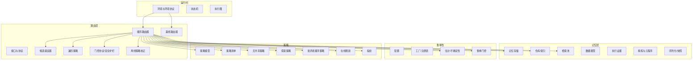
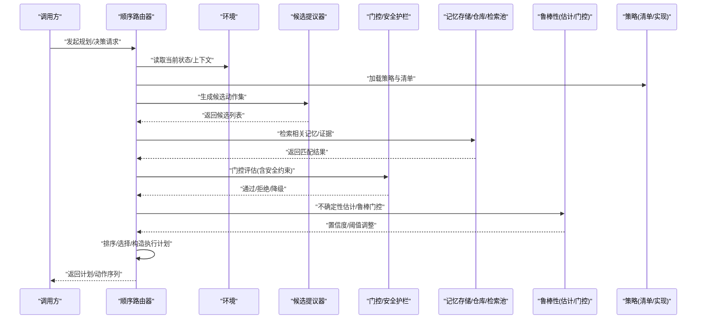
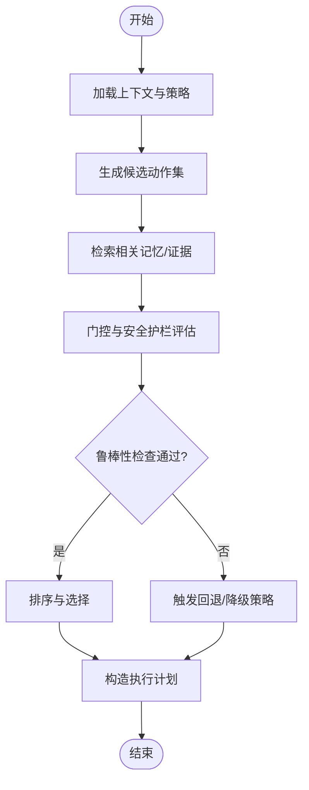
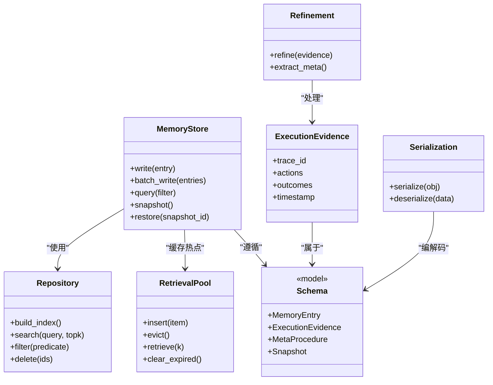
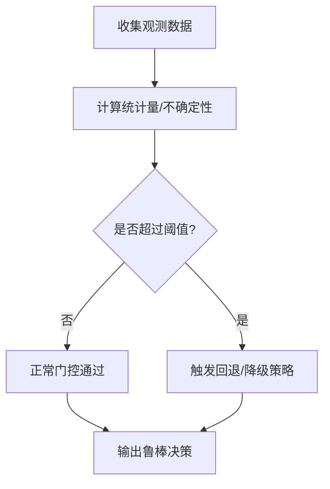
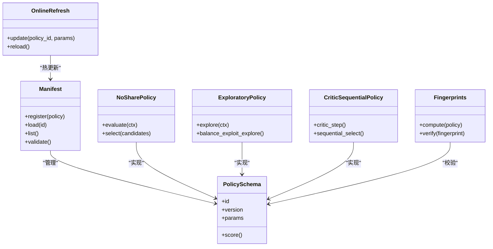
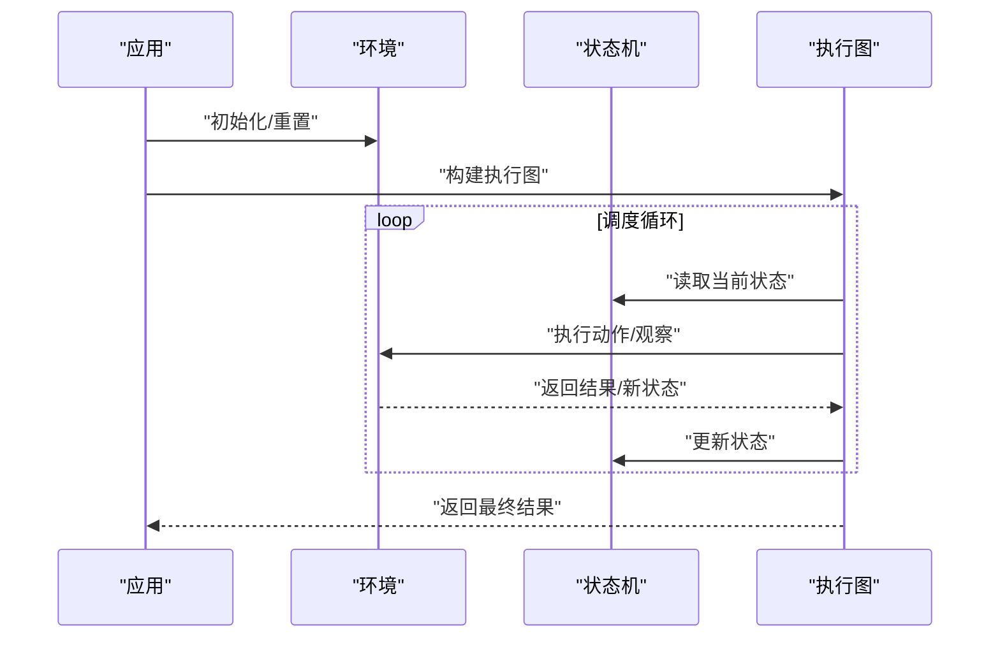
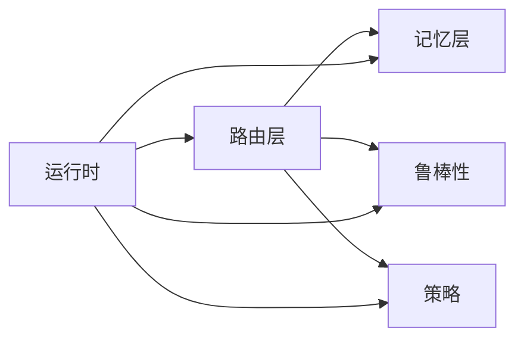

# 核心模块详解

<cite>
**本文引用的文件**   
- [src/smtr/router/__init__.py](file://src/smtr/router/__init__.py)
- [src/smtr/router/interfaces.py](file://src/smtr/router/interfaces.py)
- [src/smtr/router/factory.py](file://src/smtr/router/factory.py)
- [src/smtr/router/sequential_router.py](file://src/smtr/router/sequential_router.py)
- [src/smtr/router/baseline_router.py](file://src/smtr/router/baseline_router.py)
- [src/smtr/router/candidate_proposer.py](file://src/smtr/router/candidate_proposer.py)
- [src/smtr/router/traversal.py](file://src/smtr/router/traversal.py)
- [src/smtr/router/gate_protocol.py](file://src/smtr/router/gate_protocol.py)
- [src/smtr/router/safety_guard.py](file://src/smtr/router/safety_guard.py)
- [src/smtr/router/off_policy_correction.py](file://src/smtr/router/off_policy_correction.py)
- [src/smtr/memory/store.py](file://src/smtr/memory/store.py)
- [src/smtr/memory/repository.py](file://src/smtr/memory/repository.py)
- [src/smtr/memory/pool.py](file://src/smtr/memory/pool.py)
- [src/smtr/memory/schemas.py](file://src/smtr/memory/schemas.py)
- [src/smtr/memory/execution_evidence.py](file://src/smtr/memory/execution_evidence.py)
- [src/smtr/memory/refinement.py](file://src/smtr/memory/refinement.py)
- [src/smtr/memory/meta_procedure.py](file://src/smtr/memory/meta_procedure.py)
- [src/smtr/memory/procedure_writer.py](file://src/smtr/memory/procedure_writer.py)
- [src/smtr/memory/seed_memories.py](file://src/smtr/memory/seed_memories.py)
- [src/smtr/memory/serialization.py](file://src/smtr/memory/serialization.py)
- [src/smtr/memory/snapshot.py](file://src/smtr/memory/snapshot.py)
- [src/smtr/memory/corpus_builder.py](file://src/smtr/memory/corpus_builder.py)
- [src/smtr/memory/paired_transfer_evidence.py](file://src/smtr/memory/paired_transfer_evidence.py)
- [src/smtr/robust/config.py](file://src/smtr/robust/config.py)
- [src/smtr/robust/factory.py](file://src/smtr/robust/factory.py)
- [src/smtr/robust/registry.py](file://src/smtr/robust/registry.py)
- [src/smtr/robust/estimates.py](file://src/smtr/robust/estimates.py)
- [src/smtr/robust/uncertainty.py](file://src/smtr/robust/uncertainty.py)
- [src/smtr/robust/robust_gate.py](file://src/smtr/robust/robust_gate.py)
- [src/smtr/policy/schemas.py](file://src/smtr/policy/schemas.py)
- [src/smtr/policy/manifests.py](file://src/smtr/policy/manifests.py)
- [src/smtr/policy/no_share_policy.py](file://src/smtr/policy/no_share_policy.py)
- [src/smtr/policy/exploratory_policy.py](file://src/smtr/policy/exploratory_policy.py)
- [src/smtr/policy/critic_sequential_policy.py](file://src/smtr/policy/critic_sequential_policy.py)
- [src/smtr/policy/online_refresh.py](file://src/smtr/policy/online_refresh.py)
- [src/smtr/policy/fingerprints.py](file://src/smtr/policy/fingerprints.py)
- [src/smtr/runtime/environment.py](file://src/smtr/runtime/environment.py)
- [src/smtr/runtime/state.py](file://src/smtr/runtime/state.py)
- [src/smtr/runtime/graph.py](file://src/smtr/runtime/graph.py)
- [src/smtr/runtime/delegation_topology.py](file://src/smtr/runtime/delegation拓扑.py)
- [src/smtr/cli.py](file://src/smtr/cli.py)
- [src/smtr/config.py](file://src/smtr/config.py)
- [README.md](file://README.md)
</cite>

## 目录
1. [简介](#简介)
2. [项目结构](#项目结构)
3. [核心组件](#核心组件)
4. [架构总览](#架构总览)
5. [详细组件分析](#详细组件分析)
6. [依赖关系分析](#依赖关系分析)
7. [性能考量](#性能考量)
8. [故障排查指南](#故障排查指南)
9. [结论](#结论)
10. [附录](#附录)

## 简介
本文件面向SMTR（策略记忆与鲁棒性路由）核心模块，系统性梳理路由系统、策略管理、记忆存储、鲁棒性框架等关键子系统的职责边界、内部算法、外部接口与使用模式。文档兼顾初学者入门与高级用户深度定制需求，提供架构图、时序图、流程图以及配置与调优建议，并给出常见问题的定位思路与解决方案。

## 项目结构
SMTR采用分层与按功能域组织相结合的结构：
- router：候选生成、门控决策、顺序路由、安全护栏、离线策略校正等
- memory：记忆库、证据、元程序、序列化与快照、检索池等
- robust：不确定性估计、鲁棒门控、注册表与工厂
- policy：策略定义、清单、在线刷新、指纹等
- runtime：环境、状态机、执行图、代理编排
- cli/config：命令行入口与全局配置

图表来源
- [src/smtr/router/sequential_router.py](file://src/smtr/router/sequential_router.py)
- [src/smtr/router/baseline_router.py](file://src/smtr/router/baseline_router.py)
- [src/smtr/router/candidate_proposer.py](file://src/smtr/router/candidate_proposer.py)
- [src/smtr/router/traversal.py](file://src/smtr/router/traversal.py)
- [src/smtr/router/gate_protocol.py](file://src/smtr/router/gate_protocol.py)
- [src/smtr/router/safety_guard.py](file://src/smtr/router/safety_guard.py)
- [src/smtr/router/off_policy_correction.py](file://src/smtr/router/off_policy_correction.py)
- [src/smtr/memory/store.py](file://src/smtr/memory/store.py)
- [src/smtr/memory/repository.py](file://src/smtr/memory/repository.py)
- [src/smtr/memory/pool.py](file://src/smtr/memory/pool.py)
- [src/smtr/memory/schemas.py](file://src/smtr/memory/schemas.py)
- [src/smtr/memory/execution_evidence.py](file://src/smtr/memory/execution_evidence.py)
- [src/smtr/memory/refinement.py](file://src/smtr/memory/refinement.py)
- [src/smtr/memory/meta_procedure.py](file://src/smtr/memory/meta_procedure.py)
- [src/smtr/memory/serialization.py](file://src/smtr/memory/serialization.py)
- [src/smtr/memory/snapshot.py](file://src/smtr/memory/snapshot.py)
- [src/smtr/robust/config.py](file://src/smtr/robust/config.py)
- [src/smtr/robust/factory.py](file://src/smtr/robust/factory.py)
- [src/smtr/robust/registry.py](file://src/smtr/robust/registry.py)
- [src/smtr/robust/estimates.py](file://src/smtr/robust/estimates.py)
- [src/smtr/robust/uncertainty.py](file://src/smtr/robust/uncertainty.py)
- [src/smtr/robust/robust_gate.py](file://src/smtr/robust/robust_gate.py)
- [src/smtr/policy/schemas.py](file://src/smtr/policy/schemas.py)
- [src/smtr/policy/manifests.py](file://src/smtr/policy/manifests.py)
- [src/smtr/policy/no_share_policy.py](file://src/smtr/policy/no_share_policy.py)
- [src/smtr/policy/exploratory_policy.py](file://src/smtr/policy/exploratory_policy.py)
- [src/smtr/policy/critic_sequential_policy.py](file://src/smtr/policy/critic_sequential_policy.py)
- [src/smtr/policy/online_refresh.py](file://src/smtr/policy/online_refresh.py)
- [src/smtr/policy/fingerprints.py](file://src/smtr/policy/fingerprints.py)
- [src/smtr/runtime/environment.py](file://src/smtr/runtime/environment.py)
- [src/smtr/runtime/state.py](file://src/smtr/runtime/state.py)
- [src/smtr/runtime/graph.py](file://src/smtr/runtime/graph.py)

章节来源
- [README.md](file://README.md)
- [src/smtr/cli.py](file://src/smtr/cli.py)
- [src/smtr/config.py](file://src/smtr/config.py)

## 核心组件
本节概述各核心模块的职责与交互方式，为后续深入分析奠定基础。

- 路由系统
  - 负责在给定上下文与策略下生成候选动作序列，并通过门控与安全护栏进行筛选与保护，最终输出可执行的计划或调用序列。
  - 关键能力：顺序路由、基线对比、候选提议、遍历策略、门控协议、安全护栏、离线策略校正。

- 记忆存储
  - 提供持久化与检索的记忆基础设施，包括结构化模型、仓库索引、检索池、执行证据、精炼与元程序、序列化与快照。
  - 关键能力：读写隔离、增量更新、快照一致性、跨会话复用。

- 鲁棒性框架
  - 提供不确定性估计、鲁棒门控、配置与工厂注册机制，用于在分布偏移或噪声环境下稳定决策。
  - 关键能力：阈值自适应、置信区间、失败回退、注册扩展。

- 策略管理
  - 定义策略的数据模型、清单管理与具体策略实现（如无共享策略、探索策略、批评者顺序策略），并提供在线刷新能力。
  - 关键能力：策略版本化、指纹校验、动态加载、热更新。

- 运行时
  - 封装环境协议、状态机与执行图，协调路由、记忆与策略的协作，驱动端到端流程。
  - 关键能力：任务编排、资源隔离、错误传播、观测日志。

章节来源
- [src/smtr/router/interfaces.py](file://src/smtr/router/interfaces.py)
- [src/smtr/memory/schemas.py](file://src/smtr/memory/schemas.py)
- [src/smtr/robust/config.py](file://src/smtr/robust/config.py)
- [src/smtr/policy/schemas.py](file://src/smtr/policy/schemas.py)
- [src/smtr/runtime/environment.py](file://src/smtr/runtime/environment.py)

## 架构总览
下图展示从请求进入、路由决策到记忆存取与鲁棒性控制的端到端流程。

图表来源
- [src/smtr/router/sequential_router.py](file://src/smtr/router/sequential_router.py)
- [src/smtr/router/candidate_proposer.py](file://src/smtr/router/candidate_proposer.py)
- [src/smtr/router/gate_protocol.py](file://src/smtr/router/gate_protocol.py)
- [src/smtr/router/safety_guard.py](file://src/smtr/router/safety_guard.py)
- [src/smtr/memory/store.py](file://src/smtr/memory/store.py)
- [src/smtr/memory/repository.py](file://src/smtr/memory/repository.py)
- [src/smtr/memory/pool.py](file://src/smtr/memory/pool.py)
- [src/smtr/robust/estimates.py](file://src/smtr/robust/estimates.py)
- [src/smtr/robust/robust_gate.py](file://src/smtr/robust/robust_gate.py)
- [src/smtr/policy/manifests.py](file://src/smtr/policy/manifests.py)
- [src/smtr/runtime/environment.py](file://src/smtr/runtime/environment.py)

## 详细组件分析

### 路由系统
- 职责边界
  - 顺序路由器：组合候选提议、门控、鲁棒性与策略，形成端到端决策流水线。
  - 基线路由器：提供对照实现，便于对比实验与回归测试。
  - 候选提议器：基于上下文与策略生成候选动作集合。
  - 遍历策略：控制候选集的搜索与剪枝策略。
  - 门控协议与安全护栏：统一门控接口，实施安全约束与失败保护。
  - 离线策略校正：对历史轨迹进行偏差校正，提升泛化稳定性。

- 关键接口与数据结构
  - 路由接口：定义统一的决策函数签名、输入输出契约与追踪字段。
  - 门控协议：定义评估函数、阈值与回退策略。
  - 候选与遍历：定义候选项结构、评分与排序规则。

- 典型流程
  - 接收上下文 -> 加载策略 -> 生成候选 -> 检索记忆 -> 门控评估 -> 鲁棒性校正 -> 输出计划。

图表来源
- [src/smtr/router/sequential_router.py](file://src/smtr/router/sequential_router.py)
- [src/smtr/router/baseline_router.py](file://src/smtr/router/baseline_router.py)
- [src/smtr/router/candidate_proposer.py](file://src/smtr/router/candidate_proposer.py)
- [src/smtr/router/traversal.py](file://src/smtr/router/traversal.py)
- [src/smtr/router/gate_protocol.py](file://src/smtr/router/gate_protocol.py)
- [src/smtr/router/safety_guard.py](file://src/smtr/router/safety_guard.py)
- [src/smtr/router/off_policy_correction.py](file://src/smtr/router/off_policy_correction.py)

章节来源
- [src/smtr/router/interfaces.py](file://src/smtr/router/interfaces.py)
- [src/smtr/router/sequential_router.py](file://src/smtr/router/sequential_router.py)
- [src/smtr/router/baseline_router.py](file://src/smtr/router/baseline_router.py)
- [src/smtr/router/candidate_proposer.py](file://src/smtr/router/candidate_proposer.py)
- [src/smtr/router/traversal.py](file://src/smtr/router/traversal.py)
- [src/smtr/router/gate_protocol.py](file://src/smtr/router/gate_protocol.py)
- [src/smtr/router/safety_guard.py](file://src/smtr/router/safety_guard.py)
- [src/smtr/router/off_policy_correction.py](file://src/smtr/router/off_policy_correction.py)

### 记忆存储
- 职责边界
  - 存储与仓库：提供持久化、索引与查询能力，支持读写隔离与事务式更新。
  - 检索池：面向近实时检索的内存池，加速热点记忆访问。
  - 数据模型：定义记忆条目、证据、元程序等核心结构。
  - 执行证据：记录运行期证据，支撑审计与回溯。
  - 精炼与元程序：对记忆进行提炼与抽象，形成可复用的过程知识。
  - 序列化与快照：保证一致性的序列化与快照恢复。

- 关键接口与数据结构
  - 存储接口：增删改查、批量写入、事务提交、快照创建与恢复。
  - 仓库接口：索引构建、范围查询、过滤条件、分页与排序。
  - 检索池接口：插入、淘汰、相似度检索、过期清理。
  - 数据模型：记忆条目、执行证据、元程序、快照对象。

- 典型流程
  - 写入证据 -> 构建/更新索引 -> 检索命中 -> 精炼与元程序抽取 -> 快照落盘。

图表来源
- [src/smtr/memory/store.py](file://src/smtr/memory/store.py)
- [src/smtr/memory/repository.py](file://src/smtr/memory/repository.py)
- [src/smtr/memory/pool.py](file://src/smtr/memory/pool.py)
- [src/smtr/memory/schemas.py](file://src/smtr/memory/schemas.py)
- [src/smtr/memory/execution_evidence.py](file://src/smtr/memory/execution_evidence.py)
- [src/smtr/memory/refinement.py](file://src/smtr/memory/refinement.py)
- [src/smtr/memory/meta_procedure.py](file://src/smtr/memory/meta_procedure.py)
- [src/smtr/memory/serialization.py](file://src/smtr/memory/serialization.py)
- [src/smtr/memory/snapshot.py](file://src/smtr/memory/snapshot.py)

章节来源
- [src/smtr/memory/store.py](file://src/smtr/memory/store.py)
- [src/smtr/memory/repository.py](file://src/smtr/memory/repository.py)
- [src/smtr/memory/pool.py](file://src/smtr/memory/pool.py)
- [src/smtr/memory/schemas.py](file://src/smtr/memory/schemas.py)
- [src/smtr/memory/execution_evidence.py](file://src/smtr/memory/execution_evidence.py)
- [src/smtr/memory/refinement.py](file://src/smtr/memory/refinement.py)
- [src/smtr/memory/meta_procedure.py](file://src/smtr/memory/meta_procedure.py)
- [src/smtr/memory/procedure_writer.py](file://src/smtr/memory/procedure_writer.py)
- [src/smtr/memory/seed_memories.py](file://src/smtr/memory/seed_memories.py)
- [src/smtr/memory/serialization.py](file://src/smtr/memory/serialization.py)
- [src/smtr/memory/snapshot.py](file://src/smtr/memory/snapshot.py)
- [src/smtr/memory/corpus_builder.py](file://src/smtr/memory/corpus_builder.py)
- [src/smtr/memory/paired_transfer_evidence.py](file://src/smtr/memory/paired_transfer_evidence.py)

### 鲁棒性框架
- 职责边界
  - 配置：集中管理鲁棒性参数（阈值、窗口、回退策略）。
  - 工厂与注册表：统一创建与注册鲁棒组件，支持插件化扩展。
  - 估计与不确定性：计算置信区间、方差估计与分布偏移指标。
  - 鲁棒门控：依据不确定性动态调整门控阈值与回退路径。

- 关键接口与数据结构
  - 配置对象：包含阈值、滑动窗口大小、回退策略枚举。
  - 估计器：提供均值、方差、分位数与置信区间的计算方法。
  - 鲁棒门控：定义评估函数、阈值自适应与回退逻辑。

- 典型流程
  - 收集观测 -> 计算不确定性 -> 动态阈值 -> 门控决策 -> 回退执行。

图表来源
- [src/smtr/robust/config.py](file://src/smtr/robust/config.py)
- [src/smtr/robust/factory.py](file://src/smtr/robust/factory.py)
- [src/smtr/robust/registry.py](file://src/smtr/robust/registry.py)
- [src/smtr/robust/estimates.py](file://src/smtr/robust/estimates.py)
- [src/smtr/robust/uncertainty.py](file://src/smtr/robust/uncertainty.py)
- [src/smtr/robust/robust_gate.py](file://src/smtr/robust/robust_gate.py)

章节来源
- [src/smtr/robust/config.py](file://src/smtr/robust/config.py)
- [src/smtr/robust/factory.py](file://src/smtr/robust/factory.py)
- [src/smtr/robust/registry.py](file://src/smtr/robust/registry.py)
- [src/smtr/robust/estimates.py](file://src/smtr/robust/estimates.py)
- [src/smtr/robust/uncertainty.py](file://src/smtr/robust/uncertainty.py)
- [src/smtr/robust/robust_gate.py](file://src/smtr/robust/robust_gate.py)

### 策略管理
- 职责边界
  - 策略模型：定义策略输入输出、评分与版本信息。
  - 清单管理：维护策略注册、版本兼容与加载顺序。
  - 具体策略：无共享策略、探索策略、批评者顺序策略等。
  - 在线刷新：支持热更新与滚动升级。
  - 指纹：对策略实现进行哈希校验，确保一致性。

- 关键接口与数据结构
  - 策略接口：evaluate、select、refresh、fingerprint。
  - 清单对象：包含策略ID、版本、依赖、优先级。
  - 刷新器：增量更新策略权重与参数。

- 典型流程
  - 加载清单 -> 实例化策略 -> 指纹校验 -> 在线刷新 -> 执行评估。

图表来源
- [src/smtr/policy/schemas.py](file://src/smtr/policy/schemas.py)
- [src/smtr/policy/manifests.py](file://src/smtr/policy/manifests.py)
- [src/smtr/policy/no_share_policy.py](file://src/smtr/policy/no_share_policy.py)
- [src/smtr/policy/exploratory_policy.py](file://src/smtr/policy/exploratory_policy.py)
- [src/smtr/policy/critic_sequential_policy.py](file://src/smtr/policy/critic_sequential_policy.py)
- [src/smtr/policy/online_refresh.py](file://src/smtr/policy/online_refresh.py)
- [src/smtr/policy/fingerprints.py](file://src/smtr/policy/fingerprints.py)

章节来源
- [src/smtr/policy/schemas.py](file://src/smtr/policy/schemas.py)
- [src/smtr/policy/manifests.py](file://src/smtr/policy/manifests.py)
- [src/smtr/policy/no_share_policy.py](file://src/smtr/policy/no_share_policy.py)
- [src/smtr/policy/exploratory_policy.py](file://src/smtr/policy/exploratory_policy.py)
- [src/smtr/policy/critic_sequential_policy.py](file://src/smtr/policy/critic_sequential_policy.py)
- [src/smtr/policy/online_refresh.py](file://src/smtr/policy/online_refresh.py)
- [src/smtr/policy/fingerprints.py](file://src/smtr/policy/fingerprints.py)

### 运行时
- 职责边界
  - 环境：封装外部系统与工具调用，提供统一的环境协议。
  - 状态机：维护会话状态、事件与转换规则。
  - 执行图：编排节点与边，支持并行与重试。
  - 委托拓扑：定义代理间委托关系与消息传递。

- 关键接口与数据结构
  - 环境协议：observe、act、reset、step。
  - 状态对象：包含上下文、历史、指标与错误。
  - 图节点：定义操作、依赖与资源约束。

- 典型流程
  - 初始化环境 -> 构建执行图 -> 调度节点 -> 更新状态 -> 产出结果。

图表来源
- [src/smtr/runtime/environment.py](file://src/smtr/runtime/environment.py)
- [src/smtr/runtime/state.py](file://src/smtr/runtime/state.py)
- [src/smtr/runtime/graph.py](file://src/smtr/runtime/graph.py)
- [src/smtr/runtime/delegation_topology.py](file://src/smtr/runtime/delegation_topology.py)

章节来源
- [src/smtr/runtime/environment.py](file://src/smtr/runtime/environment.py)
- [src/smtr/runtime/state.py](file://src/smtr/runtime/state.py)
- [src/smtr/runtime/graph.py](file://src/smtr/runtime/graph.py)
- [src/smtr/runtime/delegation_topology.py](file://src/smtr/runtime/delegation_topology.py)

## 依赖关系分析
- 耦合与内聚
  - 路由层对记忆与鲁棒性存在较强依赖，但通过接口与协议解耦，保持高内聚。
  - 策略与路由松耦合，通过清单与指纹机制保障兼容性。
  - 运行时作为编排层，聚合其他子系统，避免直接业务耦合。

- 外部依赖与集成点
  - 外部环境与工具通过环境协议接入。
  - 持久化与索引由记忆仓库与序列化模块承担。
  - 鲁棒性估计可对接外部统计库或在线学习模块。

图表来源
- [src/smtr/router/sequential_router.py](file://src/smtr/router/sequential_router.py)
- [src/smtr/memory/store.py](file://src/smtr/memory/store.py)
- [src/smtr/robust/robust_gate.py](file://src/smtr/robust/robust_gate.py)
- [src/smtr/policy/manifests.py](file://src/smtr/policy/manifests.py)
- [src/smtr/runtime/environment.py](file://src/smtr/runtime/environment.py)

章节来源
- [src/smtr/router/interfaces.py](file://src/smtr/router/interfaces.py)
- [src/smtr/memory/schemas.py](file://src/smtr/memory/schemas.py)
- [src/smtr/robust/config.py](file://src/smtr/robust/config.py)
- [src/smtr/policy/schemas.py](file://src/smtr/policy/schemas.py)
- [src/smtr/runtime/environment.py](file://src/smtr/runtime/environment.py)

## 性能考量
- 路由层
  - 候选提议阶段应结合记忆检索结果进行预剪枝，减少无效分支。
  - 门控与安全护栏评估尽量向量化与批量化，降低延迟。
  - 离线策略校正可采用增量更新与缓存，避免全量重算。

- 记忆层
  - 检索池容量与淘汰策略需根据热点分布调优，平衡命中率与内存占用。
  - 索引构建与更新应异步化，避免阻塞主流程。
  - 快照频率与粒度需权衡一致性与I/O开销。

- 鲁棒性
  - 不确定性估计窗口长度与阈值需随数据分布动态调整。
  - 回退策略应快速且保守，避免级联失败。

- 策略
  - 在线刷新应采用增量更新与灰度发布，降低风险。
  - 指纹校验应在加载时完成，避免运行时开销。

[本节为通用指导，不直接分析具体文件]

## 故障排查指南
- 常见问题
  - 路由超时：检查候选提议与门控评估耗时，必要时启用批处理与缓存。
  - 记忆不一致：确认快照与索引同步，验证序列化与反序列化一致性。
  - 鲁棒性误判：调整不确定性窗口与阈值，检查回退路径是否可用。
  - 策略冲突：核对清单版本与依赖，使用指纹校验定位差异。

- 定位步骤
  - 启用详细日志与追踪字段，定位瓶颈节点。
  - 回放最近快照，复现问题并对比预期状态。
  - 使用基线路由器与无共享策略进行对照实验，缩小问题范围。

章节来源
- [src/smtr/router/sequential_router.py](file://src/smtr/router/sequential_router.py)
- [src/smtr/memory/snapshot.py](file://src/smtr/memory/snapshot.py)
- [src/smtr/robust/robust_gate.py](file://src/smtr/robust/robust_gate.py)
- [src/smtr/policy/manifests.py](file://src/smtr/policy/manifests.py)

## 结论
SMTR核心模块以清晰的分层与协议化设计实现了可扩展的路由、记忆、鲁棒性与策略体系。通过接口解耦与工厂注册，系统具备良好的可维护性与演进能力。建议在工程实践中重视性能调优与故障排查，结合基线与对照实验持续优化决策质量与稳定性。

[本节为总结性内容，不直接分析具体文件]

## 附录
- 配置选项说明
  - 鲁棒性配置：阈值、窗口、回退策略。
  - 记忆配置：池大小、索引策略、快照频率。
  - 策略配置：清单路径、版本、刷新间隔。
  - 运行时配置：并发度、超时、重试次数。

- 最佳实践
  - 使用基线路由器进行A/B测试，评估改进效果。
  - 定期生成与验证快照，确保灾难恢复能力。
  - 对高风险操作启用安全护栏与鲁棒门控双重保护。
  - 利用在线刷新与灰度发布平滑升级策略。

[本节为补充信息，不直接分析具体文件]