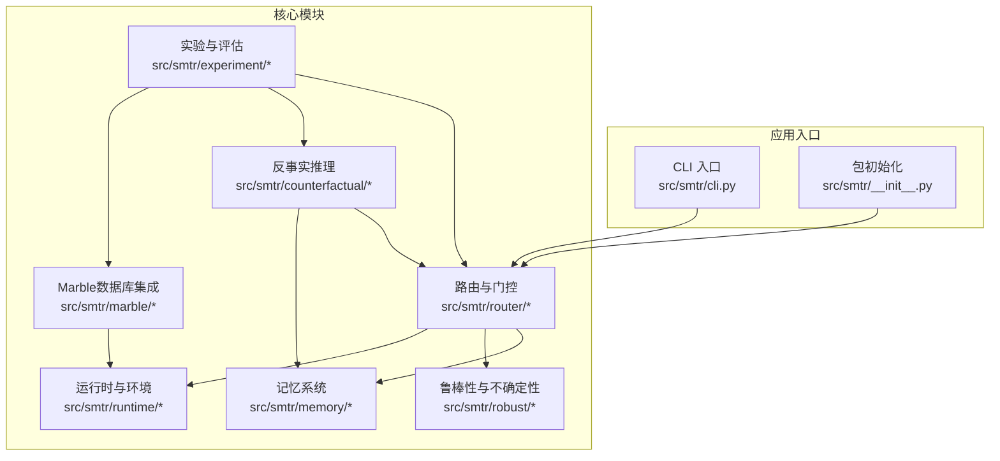
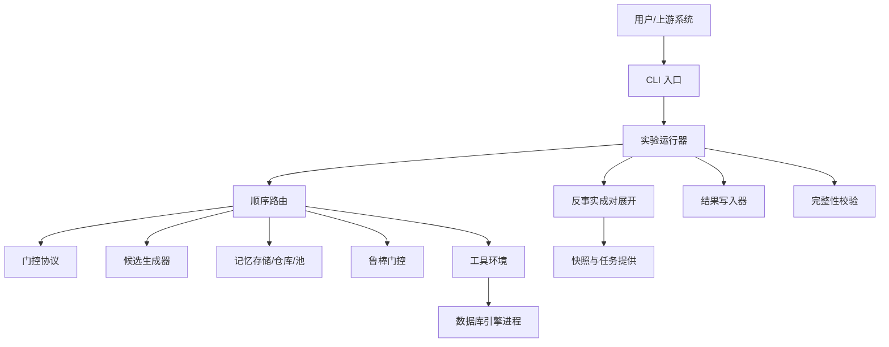
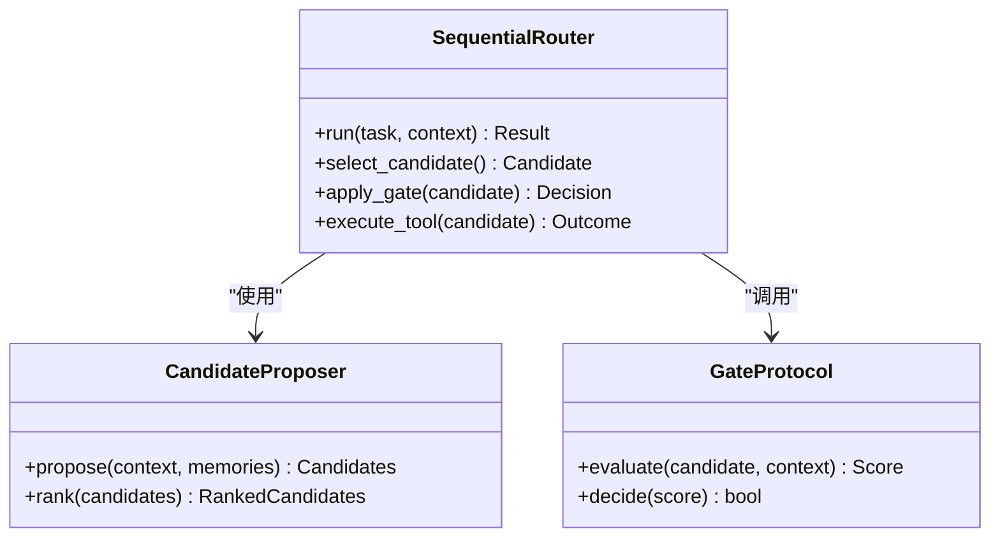
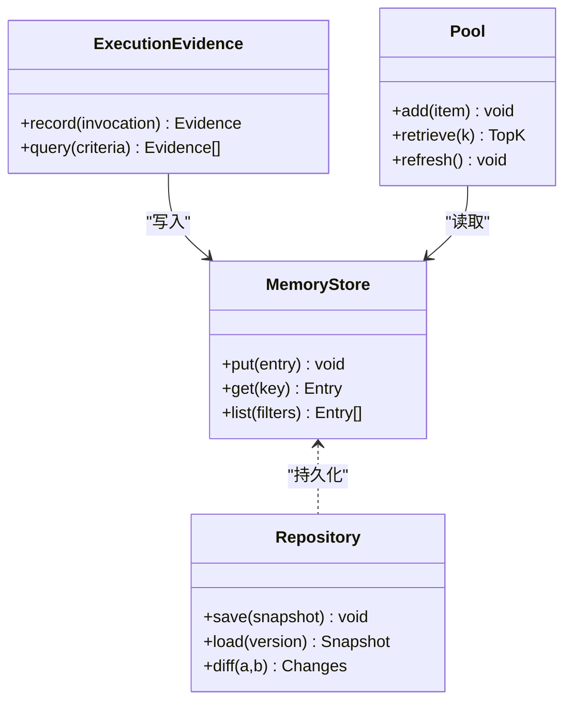
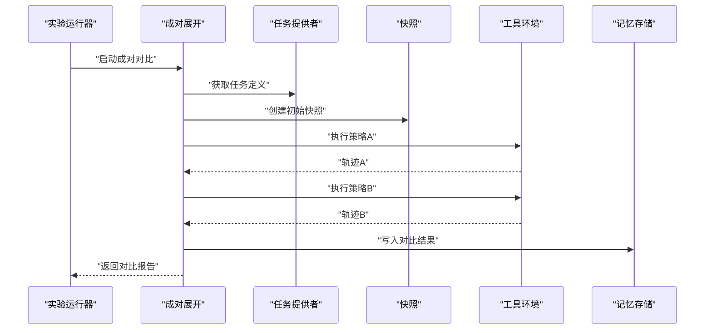
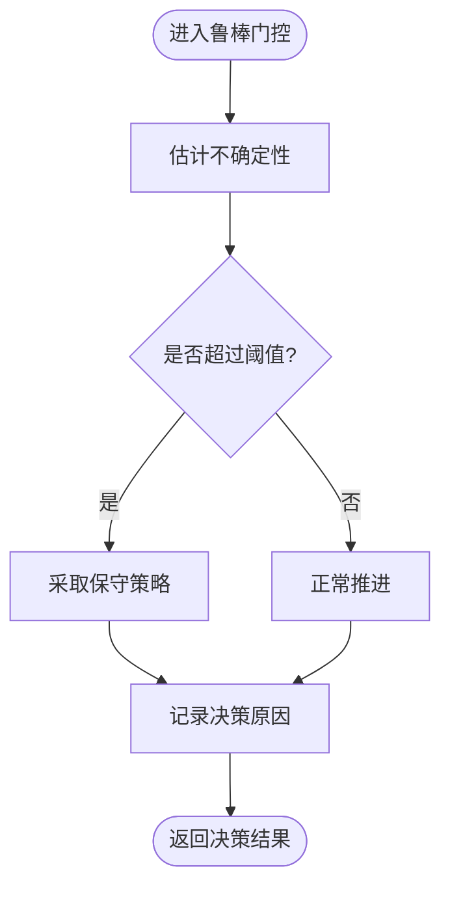
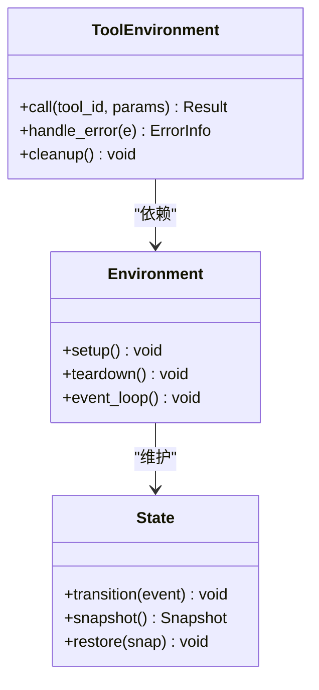
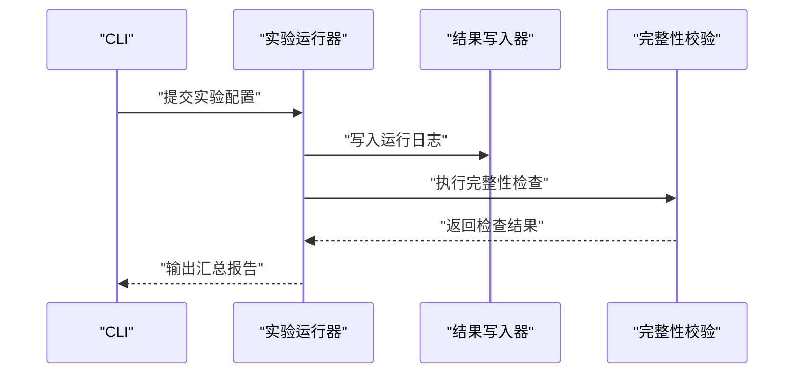
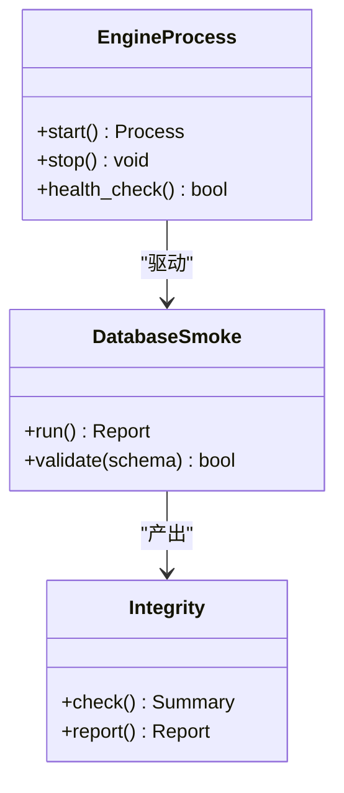
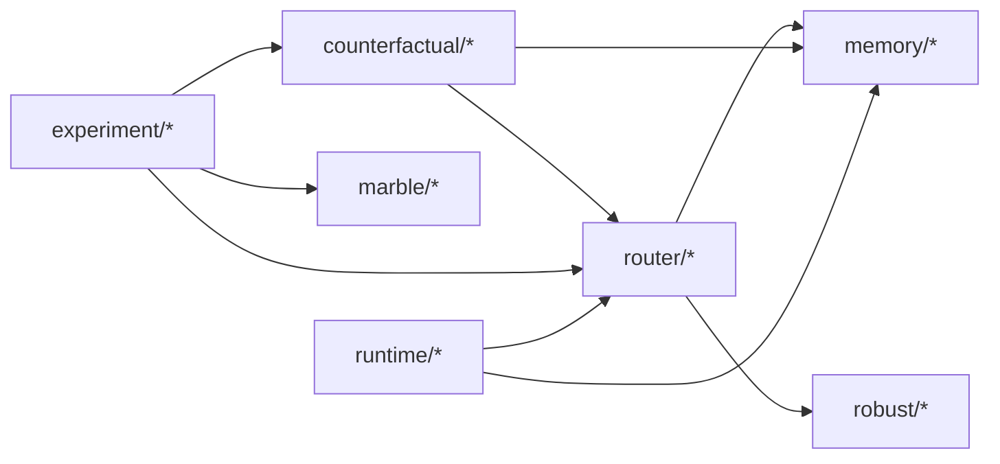

# 项目概述

<cite>
**本文引用的文件**   
- [README.md](file://README.md)
- [pyproject.toml](file://pyproject.toml)
- [src/smtr/__init__.py](file://src/smtr/__init__.py)
- [src/smtr/cli.py](file://src/smtr/cli.py)
- [src/smtr/config.py](file://src/smtr/config.py)
- [src/smtr/schemas.py](file://src/smtr/schemas.py)
- [src/smtr/router/factory.py](file://src/smtr/router/factory.py)
- [src/smtr/router/sequential_router.py](file://src/smtr/router/sequential_router.py)
- [src/smtr/router/gate_protocol.py](file://src/smtr/router/gate_protocol.py)
- [src/smtr/router/candidate_proposer.py](file://src/smtr/router/candidate_proposer.py)
- [src/smtr/memory/store.py](file://src/smtr/memory/store.py)
- [src/smtr/memory/repository.py](file://src/smtr/memory/repository.py)
- [src/smtr/memory/pool.py](file://src/smtr/memory/pool.py)
- [src/smtr/memory/execution_evidence.py](file://src/smtr/memory/execution_evidence.py)
- [src/smtr/memory/refinement.py](file://src/smtr/memory/refinement.py)
- [src/smtr/counterfactual/paired_rollout.py](file://src/smtr/counterfactual/paired_rollout.py)
- [src/smtr/counterfactual/marble_paired_rollout.py](file://src/smtr/counterfactual/marble_paired_rollout.py)
- [src/smtr/counterfactual/task_provider.py](file://src/smtr/counterfactual/task_provider.py)
- [src/smtr/counterfactual/snapshot.py](file://src/smtr/counterfactual/snapshot.py)
- [src/smtr/robust/robust_gate.py](file://src/smtr/robust/robust_gate.py)
- [src/smtr/robust/uncertainty.py](file://src/smtr/robust/uncertainty.py)
- [src/smtr/runtime/tool_environment.py](file://src/smtr/runtime/tool_environment.py)
- [src/smtr/runtime/environment.py](file://src/smtr/runtime/environment.py)
- [src/smtr/runtime/state.py](file://src/smtr/runtime/state.py)
- [src/smtr/experiment/runner.py](file://src/smtr/experiment/runner.py)
- [src/smtr/experiment/writer.py](file://src/smtr/experiment/writer.py)
- [src/smtr/marble/engine_process.py](file://src/smtr/marble/engine_process.py)
- [src/smtr/marble/database_smoke.py](file://src/smtr/marble/database_smoke.py)
- [src/smtr/marble/integrity.py](file://src/smtr/marble/integrity.py)
</cite>

## 目录
1. [简介](#简介)
2. [项目结构](#项目结构)
3. [核心组件](#核心组件)
4. [架构总览](#架构总览)
5. [详细组件分析](#详细组件分析)
6. [依赖关系分析](#依赖关系分析)
7. [性能考量](#性能考量)
8. [故障排查指南](#故障排查指南)
9. [结论](#结论)
10. [附录：快速开始](#附录快速开始)

## 简介
SMTR（Serialized Multi-Tool Router）是一个序列化的多工具路由框架，面向AI决策系统与工具调用优化场景。其核心目标是在复杂、动态的工具生态中，以可解释、可审计、可复现的方式完成“候选工具选择—执行—评估—记忆增强”的闭环，并通过反事实推理与鲁棒性保障提升决策质量与稳定性。

主要特性与技术优势包括：
- 序列化路由与门控机制：将工具调用过程显式建模为可追踪的序列，支持顺序路由、候选生成与门控筛选。
- 反事实推理引擎：提供成对对比与干预能力，用于评估不同策略或配置在相同任务下的差异影响。
- 记忆增强机制：通过执行证据、元程序与检索池，沉淀历史经验并在线更新，提高后续决策效率与准确性。
- 鲁棒性与不确定性估计：引入鲁棒门控与不确定性度量，降低噪声与分布偏移带来的风险。
- 实验与评估体系：内置完整的实验运行器、结果写入与完整性校验流程，便于A/B与消融研究。
- 数据库集成与隔离：通过Marble子系统对接真实数据库环境，提供数据重建、冒烟测试与一致性检查。

在AI决策系统和工具调用优化领域的定位与价值：
- 为多工具编排提供统一、可扩展的运行时与协议层，屏蔽底层工具差异。
- 以反事实与记忆增强为核心，实现从“单次最优”到“长期稳健”的策略演进。
- 通过严格的实验与审计能力，支撑生产级部署的可信度与可追溯性。

## 项目结构
仓库采用模块化分层组织，核心代码位于 src/smtr，按功能域划分为 router、memory、counterfactual、robust、runtime、experiment、marble 等子包；tests 覆盖关键路径与边界条件；artifacts、outputs、data 存放实验产物与数据集；scripts 提供常用脚本入口。

图表来源
- [src/smtr/cli.py:1-200](file://src/smtr/cli.py#L1-L200)
- [src/smtr/__init__.py:1-200](file://src/smtr/__init__.py#L1-L200)
- [src/smtr/router/factory.py:1-200](file://src/smtr/router/factory.py#L1-L200)
- [src/smtr/memory/store.py:1-200](file://src/smtr/memory/store.py#L1-L200)
- [src/smtr/counterfactual/paired_rollout.py:1-200](file://src/smtr/counterfactual/paired_rollout.py#L1-L200)
- [src/smtr/robust/robust_gate.py:1-200](file://src/smtr/robust/robust_gate.py#L1-L200)
- [src/smtr/runtime/tool_environment.py:1-200](file://src/smtr/runtime/tool_environment.py#L1-L200)
- [src/smtr/experiment/runner.py:1-200](file://src/smtr/experiment/runner.py#L1-L200)
- [src/smtr/marble/engine_process.py:1-200](file://src/smtr/marble/engine_process.py#L1-L200)

章节来源
- [README.md:1-200](file://README.md#L1-L200)
- [pyproject.toml:1-200](file://pyproject.toml#L1-L200)
- [src/smtr/__init__.py:1-200](file://src/smtr/__init__.py#L1-L200)
- [src/smtr/cli.py:1-200](file://src/smtr/cli.py#L1-L200)

## 核心组件
- 路由与门控
  - 顺序路由：基于候选集与门控策略进行串行选择与执行。
  - 候选生成：根据上下文与记忆检索提出候选工具集合。
  - 门控协议：定义统一的门控接口，支持多种策略（如因果门、安全守卫）。
- 记忆系统
  - 存储与仓库：持久化记忆条目与版本快照，支持读写分离与一致性。
  - 执行证据：记录工具调用的输入输出与中间状态，形成可回溯的证据链。
  - 检索池与精炼：维护高相关性的记忆片段，并提供精炼与压缩策略。
- 反事实推理
  - 成对展开：在同一任务下并行执行不同策略或配置，产出可比轨迹。
  - 任务提供与快照：抽象任务源与状态快照，确保对比公平与可复现。
- 鲁棒性与不确定性
  - 鲁棒门控：在不确定环境下做出保守决策，避免高风险路径。
  - 不确定性估计：量化模型或环境的置信度，辅助门控阈值自适应。
- 运行时与环境
  - 工具环境：封装外部工具的调用接口、错误处理与资源管理。
  - 环境与状态：维护会话级状态机，驱动生命周期与事件流。
- 实验与评估
  - 运行器：编排实验任务、参数扫描与并发控制。
  - 写入器：结构化输出指标、轨迹与诊断信息，便于下游分析。
- Marble数据库集成
  - 引擎进程：管理与数据库引擎的交互进程，提供隔离与超时控制。
  - 冒烟测试与完整性：验证数据库连通性、数据一致性与迁移正确性。

章节来源
- [src/smtr/router/sequential_router.py:1-200](file://src/smtr/router/sequential_router.py#L1-L200)
- [src/smtr/router/candidate_proposer.py:1-200](file://src/smtr/router/candidate_proposer.py#L1-L200)
- [src/smtr/router/gate_protocol.py:1-200](file://src/smtr/router/gate_protocol.py#L1-L200)
- [src/smtr/memory/store.py:1-200](file://src/smtr/memory/store.py#L1-L200)
- [src/smtr/memory/repository.py:1-200](file://src/smtr/memory/repository.py#L1-L200)
- [src/smtr/memory/execution_evidence.py:1-200](file://src/smtr/memory/execution_evidence.py#L1-L200)
- [src/smtr/memory/pool.py:1-200](file://src/smtr/memory/pool.py#L1-L200)
- [src/smtr/memory/refinement.py:1-200](file://src/smtr/memory/refinement.py#L1-L200)
- [src/smtr/counterfactual/paired_rollout.py:1-200](file://src/smtr/counterfactual/paired_rollout.py#L1-L200)
- [src/smtr/counterfactual/marble_paired_rollout.py:1-200](file://src/smtr/counterfactual/marble_paired_rollout.py#L1-L200)
- [src/smtr/counterfactual/task_provider.py:1-200](file://src/smtr/counterfactual/task_provider.py#L1-L200)
- [src/smtr/counterfactual/snapshot.py:1-200](file://src/smtr/counterfactual/snapshot.py#L1-L200)
- [src/smtr/robust/robust_gate.py:1-200](file://src/smtr/robust/robust_gate.py#L1-L200)
- [src/smtr/robust/uncertainty.py:1-200](file://src/smtr/robust/uncertainty.py#L1-L200)
- [src/smtr/runtime/tool_environment.py:1-200](file://src/smtr/runtime/tool_environment.py#L1-L200)
- [src/smtr/runtime/environment.py:1-200](file://src/smtr/runtime/environment.py#L1-L200)
- [src/smtr/runtime/state.py:1-200](file://src/smtr/runtime/state.py#L1-L200)
- [src/smtr/experiment/runner.py:1-200](file://src/smtr/experiment/runner.py#L1-L200)
- [src/smtr/experiment/writer.py:1-200](file://src/smtr/experiment/writer.py#L1-L200)
- [src/smtr/marble/engine_process.py:1-200](file://src/smtr/marble/engine_process.py#L1-L200)
- [src/smtr/marble/database_smoke.py:1-200](file://src/smtr/marble/database_smoke.py#L1-L200)
- [src/smtr/marble/integrity.py:1-200](file://src/smtr/marble/integrity.py#L1-L200)

## 架构总览
SMTR的整体架构围绕“路由—记忆—反事实—鲁棒性—运行时—实验—数据库集成”七大模块协同工作。入口CLI负责解析参数与调度，路由模块依据候选与门控策略驱动工具调用，记忆系统在运行中积累与检索经验，反事实模块提供对比与干预能力，鲁棒性模块保障不确定性下的稳定决策，运行时模块封装工具与环境细节，实验模块负责端到端编排与产出，Marble模块提供数据库层面的可靠性保证。

图表来源
- [src/smtr/cli.py:1-200](file://src/smtr/cli.py#L1-L200)
- [src/smtr/experiment/runner.py:1-200](file://src/smtr/experiment/runner.py#L1-L200)
- [src/smtr/router/sequential_router.py:1-200](file://src/smtr/router/sequential_router.py#L1-L200)
- [src/smtr/router/gate_protocol.py:1-200](file://src/smtr/router/gate_protocol.py#L1-L200)
- [src/smtr/router/candidate_proposer.py:1-200](file://src/smtr/router/candidate_proposer.py#L1-L200)
- [src/smtr/memory/store.py:1-200](file://src/smtr/memory/store.py#L1-L200)
- [src/smtr/robust/robust_gate.py:1-200](file://src/smtr/robust/robust_gate.py#L1-L200)
- [src/smtr/runtime/tool_environment.py:1-200](file://src/smtr/runtime/tool_environment.py#L1-L200)
- [src/smtr/marble/engine_process.py:1-200](file://src/smtr/marble/engine_process.py#L1-L200)
- [src/smtr/counterfactual/paired_rollout.py:1-200](file://src/smtr/counterfactual/paired_rollout.py#L1-L200)
- [src/smtr/counterfactual/snapshot.py:1-200](file://src/smtr/counterfactual/snapshot.py#L1-L200)
- [src/smtr/experiment/writer.py:1-200](file://src/smtr/experiment/writer.py#L1-L200)
- [src/smtr/marble/integrity.py:1-200](file://src/smtr/marble/integrity.py#L1-L200)

## 详细组件分析

### 路由与门控组件
- 顺序路由负责串联候选生成、门控评估与工具执行，维护步骤级状态与轨迹。
- 候选生成器结合上下文与记忆检索，输出候选工具集合及其描述。
- 门控协议定义统一的评估接口，支持因果门、安全守卫等多种策略。

图表来源
- [src/smtr/router/sequential_router.py:1-200](file://src/smtr/router/sequential_router.py#L1-L200)
- [src/smtr/router/candidate_proposer.py:1-200](file://src/smtr/router/candidate_proposer.py#L1-L200)
- [src/smtr/router/gate_protocol.py:1-200](file://src/smtr/router/gate_protocol.py#L1-L200)

章节来源
- [src/smtr/router/factory.py:1-200](file://src/smtr/router/factory.py#L1-L200)
- [src/smtr/router/sequential_router.py:1-200](file://src/smtr/router/sequential_router.py#L1-L200)
- [src/smtr/router/candidate_proposer.py:1-200](file://src/smtr/router/candidate_proposer.py#L1-L200)
- [src/smtr/router/gate_protocol.py:1-200](file://src/smtr/router/gate_protocol.py#L1-L200)

### 记忆系统组件
- 存储与仓库提供持久化能力，支持版本化与一致性约束。
- 执行证据记录每次工具调用的输入、输出与中间状态，形成可审计链路。
- 检索池与精炼模块维护高相关性记忆片段，支持压缩与更新。

图表来源
- [src/smtr/memory/store.py:1-200](file://src/smtr/memory/store.py#L1-L200)
- [src/smtr/memory/repository.py:1-200](file://src/smtr/memory/repository.py#L1-L200)
- [src/smtr/memory/execution_evidence.py:1-200](file://src/smtr/memory/execution_evidence.py#L1-L200)
- [src/smtr/memory/pool.py:1-200](file://src/smtr/memory/pool.py#L1-L200)
- [src/smtr/memory/refinement.py:1-200](file://src/smtr/memory/refinement.py#L1-L200)

章节来源
- [src/smtr/memory/store.py:1-200](file://src/smtr/memory/store.py#L1-L200)
- [src/smtr/memory/repository.py:1-200](file://src/smtr/memory/repository.py#L1-L200)
- [src/smtr/memory/execution_evidence.py:1-200](file://src/smtr/memory/execution_evidence.py#L1-L200)
- [src/smtr/memory/pool.py:1-200](file://src/smtr/memory/pool.py#L1-L200)
- [src/smtr/memory/refinement.py:1-200](file://src/smtr/memory/refinement.py#L1-L200)

### 反事实推理组件
- 成对展开在同一任务下并行执行不同策略或配置，产出可比轨迹。
- 任务提供者与快照抽象任务源与状态快照，确保对比公平与可复现。
- 针对Marble环境的成对展开支持数据库隔离与一致性检查。

图表来源
- [src/smtr/counterfactual/paired_rollout.py:1-200](file://src/smtr/counterfactual/paired_rollout.py#L1-L200)
- [src/smtr/counterfactual/marble_paired_rollout.py:1-200](file://src/smtr/counterfactual/marble_paired_rollout.py#L1-L200)
- [src/smtr/counterfactual/task_provider.py:1-200](file://src/smtr/counterfactual/task_provider.py#L1-L200)
- [src/smtr/counterfactual/snapshot.py:1-200](file://src/smtr/counterfactual/snapshot.py#L1-L200)
- [src/smtr/runtime/tool_environment.py:1-200](file://src/smtr/runtime/tool_environment.py#L1-L200)
- [src/smtr/memory/store.py:1-200](file://src/smtr/memory/store.py#L1-L200)

章节来源
- [src/smtr/counterfactual/paired_rollout.py:1-200](file://src/smtr/counterfactual/paired_rollout.py#L1-L200)
- [src/smtr/counterfactual/marble_paired_rollout.py:1-200](file://src/smtr/counterfactual/marble_paired_rollout.py#L1-L200)
- [src/smtr/counterfactual/task_provider.py:1-200](file://src/smtr/counterfactual/task_provider.py#L1-L200)
- [src/smtr/counterfactual/snapshot.py:1-200](file://src/smtr/counterfactual/snapshot.py#L1-L200)

### 鲁棒性与不确定性组件
- 鲁棒门控在不确定性较高时采取保守策略，避免高风险路径。
- 不确定性估计量化模型或环境的置信度，辅助门控阈值自适应调整。

图表来源
- [src/smtr/robust/robust_gate.py:1-200](file://src/smtr/robust/robust_gate.py#L1-L200)
- [src/smtr/robust/uncertainty.py:1-200](file://src/smtr/robust/uncertainty.py#L1-L200)

章节来源
- [src/smtr/robust/robust_gate.py:1-200](file://src/smtr/robust/robust_gate.py#L1-L200)
- [src/smtr/robust/uncertainty.py:1-200](file://src/smtr/robust/uncertainty.py#L1-L200)

### 运行时与环境组件
- 工具环境封装外部工具调用、错误处理与资源管理。
- 环境与状态维护会话级状态机，驱动生命周期与事件流。

图表来源
- [src/smtr/runtime/tool_environment.py:1-200](file://src/smtr/runtime/tool_environment.py#L1-L200)
- [src/smtr/runtime/environment.py:1-200](file://src/smtr/runtime/environment.py#L1-L200)
- [src/smtr/runtime/state.py:1-200](file://src/smtr/runtime/state.py#L1-L200)

章节来源
- [src/smtr/runtime/tool_environment.py:1-200](file://src/smtr/runtime/tool_environment.py#L1-L200)
- [src/smtr/runtime/environment.py:1-200](file://src/smtr/runtime/environment.py#L1-L200)
- [src/smtr/runtime/state.py:1-200](file://src/smtr/runtime/state.py#L1-L200)

### 实验与评估组件
- 运行器编排实验任务、参数扫描与并发控制。
- 写入器结构化输出指标、轨迹与诊断信息，便于下游分析。

图表来源
- [src/smtr/experiment/runner.py:1-200](file://src/smtr/experiment/runner.py#L1-L200)
- [src/smtr/experiment/writer.py:1-200](file://src/smtr/experiment/writer.py#L1-L200)
- [src/smtr/marble/integrity.py:1-200](file://src/smtr/marble/integrity.py#L1-L200)

章节来源
- [src/smtr/experiment/runner.py:1-200](file://src/smtr/experiment/runner.py#L1-L200)
- [src/smtr/experiment/writer.py:1-200](file://src/smtr/experiment/writer.py#L1-L200)
- [src/smtr/marble/integrity.py:1-200](file://src/smtr/marble/integrity.py#L1-L200)

### Marble数据库集成组件
- 引擎进程管理与数据库引擎的交互进程，提供隔离与超时控制。
- 冒烟测试与完整性验证数据库连通性、数据一致性与迁移正确性。

图表来源
- [src/smtr/marble/engine_process.py:1-200](file://src/smtr/marble/engine_process.py#L1-L200)
- [src/smtr/marble/database_smoke.py:1-200](file://src/smtr/marble/database_smoke.py#L1-L200)
- [src/smtr/marble/integrity.py:1-200](file://src/smtr/marble/integrity.py#L1-L200)

章节来源
- [src/smtr/marble/engine_process.py:1-200](file://src/smtr/marble/engine_process.py#L1-L200)
- [src/smtr/marble/database_smoke.py:1-200](file://src/smtr/marble/database_smoke.py#L1-L200)
- [src/smtr/marble/integrity.py:1-200](file://src/smtr/marble/integrity.py#L1-L200)

## 依赖关系分析
SMTR内部模块遵循清晰的分层与职责划分，router依赖memory与robust，counterfactual依赖router与memory，experiment协调router、counterfactual与marble，runtime为各模块提供工具与环境抽象。

图表来源
- [src/smtr/router/factory.py:1-200](file://src/smtr/router/factory.py#L1-L200)
- [src/smtr/memory/store.py:1-200](file://src/smtr/memory/store.py#L1-L200)
- [src/smtr/robust/robust_gate.py:1-200](file://src/smtr/robust/robust_gate.py#L1-L200)
- [src/smtr/counterfactual/paired_rollout.py:1-200](file://src/smtr/counterfactual/paired_rollout.py#L1-L200)
- [src/smtr/experiment/runner.py:1-200](file://src/smtr/experiment/runner.py#L1-L200)
- [src/smtr/marble/engine_process.py:1-200](file://src/smtr/marble/engine_process.py#L1-L200)
- [src/smtr/runtime/tool_environment.py:1-200](file://src/smtr/runtime/tool_environment.py#L1-L200)

章节来源
- [src/smtr/router/factory.py:1-200](file://src/smtr/router/factory.py#L1-L200)
- [src/smtr/memory/store.py:1-200](file://src/smtr/memory/store.py#L1-L200)
- [src/smtr/robust/robust_gate.py:1-200](file://src/smtr/robust/robust_gate.py#L1-L200)
- [src/smtr/counterfactual/paired_rollout.py:1-200](file://src/smtr/counterfactual/paired_rollout.py#L1-L200)
- [src/smtr/experiment/runner.py:1-200](file://src/smtr/experiment/runner.py#L1-L200)
- [src/smtr/marble/engine_process.py:1-200](file://src/smtr/marble/engine_process.py#L1-L200)
- [src/smtr/runtime/tool_environment.py:1-200](file://src/smtr/runtime/tool_environment.py#L1-L200)

## 性能考量
- 候选生成与排序：建议结合记忆检索与缓存策略减少重复计算。
- 门控评估：在高并发场景下采用批量化与异步调用，降低延迟。
- 记忆精炼：定期压缩与去重，控制存储规模与检索开销。
- 鲁棒门控：动态阈值与早退机制，避免不必要的深度搜索。
- 实验运行：合理设置并发度与资源配额，避免I/O瓶颈。

[本节为通用指导，不直接分析具体文件]

## 故障排查指南
- 工具调用失败：检查工具环境错误处理与重试策略，确认外部服务可用性。
- 记忆不一致：验证仓库版本与快照一致性，必要时回滚至最近稳定版本。
- 反事实对比异常：核对任务提供者与快照创建逻辑，确保对比基线一致。
- 鲁棒门控误判：审查不确定性估计方法与阈值设置，调整保守程度。
- 数据库连通问题：运行冒烟测试与完整性检查，确认引擎进程健康状态。

章节来源
- [src/smtr/runtime/tool_environment.py:1-200](file://src/smtr/runtime/tool_environment.py#L1-L200)
- [src/smtr/memory/repository.py:1-200](file://src/smtr/memory/repository.py#L1-L200)
- [src/smtr/counterfactual/task_provider.py:1-200](file://src/smtr/counterfactual/task_provider.py#L1-L200)
- [src/smtr/robust/uncertainty.py:1-200](file://src/smtr/robust/uncertainty.py#L1-L200)
- [src/smtr/marble/database_smoke.py:1-200](file://src/smtr/marble/database_smoke.py#L1-L200)
- [src/smtr/marble/integrity.py:1-200](file://src/smtr/marble/integrity.py#L1-L200)

## 结论
SMTR通过序列化的多工具路由、反事实推理与记忆增强，构建了面向AI决策与工具调用优化的完整技术栈。其鲁棒性与不确定性估计提升了在复杂环境中的稳定性，实验与评估体系保障了可复现与可审计。配合Marble数据库集成，SMTR在生产环境中具备较高的可信度与扩展性。

[本节为总结性内容，不直接分析具体文件]

## 附录：快速开始
- 安装与依赖
  - 使用Python生态与项目配置文件进行依赖管理。
  - 参考项目根目录的配置文件与说明文档进行环境准备。
- 运行示例
  - 通过CLI入口加载配置并启动实验或单任务运行。
  - 使用实验运行器编排任务，查看结果写入与完整性报告。
- 常见问题
  - 若遇到工具调用失败，检查工具环境与外部服务状态。
  - 若记忆检索效果不佳，调整检索池大小与精炼策略。
  - 若反事实对比结果不稳定，核对任务与快照的一致性。

章节来源
- [README.md:1-200](file://README.md#L1-L200)
- [pyproject.toml:1-200](file://pyproject.toml#L1-L200)
- [src/smtr/cli.py:1-200](file://src/smtr/cli.py#L1-L200)
- [src/smtr/experiment/runner.py:1-200](file://src/smtr/experiment/runner.py#L1-L200)
- [src/smtr/experiment/writer.py:1-200](file://src/smtr/experiment/writer.py#L1-L200)